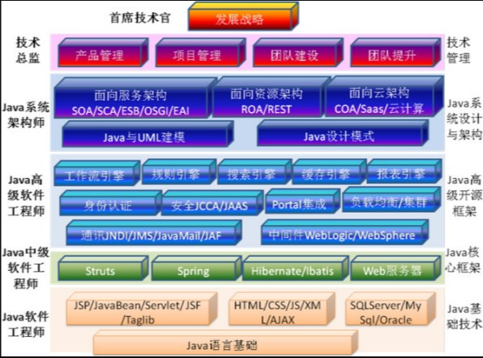

# JAVA架构师之路

## 初级水平（认知理解技术为主）

项目实战方面

1. 能够熟练使用三大框架或者springboot进行基本的业务开发，熟悉MVC架构 
2.  能写工作流，熟悉常用的设计模式 

java部分

1. 能熟练应用封装，继承，多态这三大特性。能熟练使用list，set等collection接口，及map接口。  
2. 对java的较为复杂的技术能够灵活使用如：多线程，反射，io流，网络编程和数据库
3. sql能够熟练掌握，如子查询，mybatis的复杂查询 

技术栈

1. Java语言基础
2. 基本算法
3. JSP相关
   1. JSP
   2. JavaBean
   3. Servlet
   4. JSF
   5. Taglib
4. HTML相关
   1. HTML
   2. CSS
   3. Javascript
   4. XML
   5. AJAX
5. 数据库相关
   - MySql
   - SQL Server
   - Oracle
6. 熟悉常见Java设计模式

##  中级水平（利用技术解决复杂业务和理解技术的原理为主）

1. 对常用的框架的原理有较清晰的理解，能够掌握其设计思想和所用到的设计模式。  
2. 能独立的完成项目的某些模块的任务  
3. 能够进行性能优化，代码规范，编程习惯良好无冗余代码  
4. 对缓存，事务管理，日志，分布式等复杂技术有着深入理解  

技术栈

1. Spring
2. Struts
3. Hibernate
4. MyBatis
5. Web服务器
   - Tomcat
6. SpringMVC
7. 熟悉SpringCloud

## 高级水平（技术领导） 

1. 能对需求进行架构设计，选择框架以适应最合适的业务，作为某个项目的领导，带领团队完成项目。  
2. 有自己的开源项目，可以写出自己的组件，对开源的框架能够进行二次编写，java核心技术有着非常深入的理解  架构师  能管理多个高级工程师及以下级别，提升工作效率  其发展战略可以

技术栈

1. 工作流引擎
2. 规则引擎
3. 搜索引擎
4. 缓存引擎
5. 报表引擎
6. 身份认证
7. 安全JCCA/JAAS
8. Portal集成
9. 负载均衡/集群
10. 通信
    * JNDI
    * JMS
    * JavaMail
    * JAF
11. 中间件
    * WebLogic
    * WebSphere
12. 熟悉Java设计模式
13. 精通SpringCloud

## Java系统架构师

1. 面向服务架构
   - SOA
   - SCA
   - ESB
   - OSG
   - EAI
2. 面向资源架构
   - ROA
   - REST
3. 面向云计算架构
   - COA
   - IaaS
   - PaaS
   - SaaS
   - FaaS
4. Java与UML建模
5. 精通Java设计模式

## 技术总监

技术栈

1. 产品管理
2. 项目管理
3. 团队建设
4. 团队提升

## 首席技术官CTO

1. 发展战略

# 参考

​            