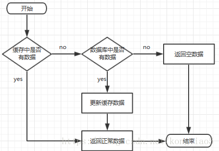

# 缓存相关问题

## 缓存穿透、缓存击穿、缓存雪崩区别和解决方案

### 一、缓存处理流程

前台请求，后台先从缓存中取数据，取到直接返回结果，取不到时从数据库中取，数据库取到更新缓存，并返回结果，数据库也没取到，那直接返回空结果。



 

### 二、缓存穿透

**描述：**

缓存穿透是指缓存和数据库中都没有的数据，而用户不断发起请求，如发起为id为“-1”的数据或id为特别大不存在的数据。这时的用户很可能是攻击者，攻击会导致数据库压力过大。

**解决方案：**

1. 接口层增加校验，如用户鉴权校验，id做基础校验，id<=0的直接拦截；
2. 从缓存取不到的数据，在数据库中也没有取到，这时也可以将key-value对写为key-null，缓存有效时间可以设置短点，如30秒（设置太长会导致正常情况也没法使用）。这样可以防止攻击用户反复用同一个id暴力攻击

### 三、缓存击穿

**描述：**

缓存击穿是指缓存中没有但数据库中有的数据（一般是缓存时间到期），这时由于并发用户特别多，同时读缓存没读到数据，又同时去数据库去取数据，引起数据库压力瞬间增大，造成过大压力

**解决方案：**

1. 设置热点数据永远不过期。
2. 加互斥锁，互斥锁参考代码如下：

```
    /**
     * 从缓存中获取数据
     * @param key
     * @return
     * @throws InterruptedException
     */
    public static String getDataFromCache(String key) throws InterruptedException {
        String result = getDataFromRedis(key);
        if (StringUtils.isBlank(result)) {
            // 获取锁,获取成功,则去数据库中取数据
            if (reenLock.tryLock()) {
                // 从数据库中取到数据
                result = getDataFromMysql(key);
                if (StringUtils.isNotBlank(result)) {
                    setDataToCache(key, result);
                }
                // 释放锁
                reenLock.unlock();
            } else {
                // 获取锁失败，暂停 100ms 再去取数据
                Thread.sleep(100);
                result = getDataFromCache(key);
            }
        }
        return result;
    }
```

说明：

1）缓存中有数据，直接走上述代码13行后就返回结果了

2）缓存中没有数据，第1个进入的线程，获取锁并从数据库去取数据，没释放锁之前，其他并行进入的线程会等待100ms，再重新去缓存取数据。这样就防止都去数据库重复取数据，重复往缓存中更新数据情况出现。

3）当然这是简化处理，理论上如果能根据key值加锁就更好了，就是线程A从数据库取key1的数据并不妨碍线程B取key2的数据，上面代码明显做不到这点。

### 四、缓存雪崩

**描述：**

缓存雪崩是指缓存中数据大批量到过期时间，而查询数据量巨大，引起数据库压力过大甚至down机。和缓存击穿不同的是，缓存击穿指并发查同一条数据，缓存雪崩是不同数据都过期了，很多数据都查不到从而查数据库。

**解决方案**：

1. 缓存数据的过期时间设置随机，防止同一时间大量数据过期现象发生。
2. 如果缓存数据库是分布式部署，将热点数据均匀分布在不同搞得缓存数据库中。
3. 设置热点数据永远不过期。

## 常见页面置换算法

**最佳置换算法（OPT）**

这是一种理想情况下的页面置换算法，但实际上是不可能实现的。该算法的基本思想是：发生缺页时，有些页面在内存中，其中有一页将很快被访问（也包含紧接着的下一条[指令](https://baike.baidu.com/item/指令/3225201)的那页），而其他页面则可能要到10、100或者1000条指令后才会被访问，每个页面都可以用在该页面首次被访问前所要执行的指令数进行标记。最佳页面置换算法只是简单地规定：标记最大的页应该被置换。这个算法唯一的一个问题就是它无法实现。当缺页发生时，操作系统无法知道各个页面下一次是在什么时候被访问。虽然这个算法不可能实现，但是最佳页面置换算法可以用于对可实现算法的性能进行衡量比较。

**先进先出置换算法（FIFO）**

最简单的页面置换算法是先入先出（FIFO）法。这种算法的实质是，总是选择在主存中停留时间最长（即最老）的一页置换，即先进入内存的页，先退出内存。理由是：最早调入内存的页，其不再被使用的可能性比刚调入内存的可能性大。建立一个FIFO队列，收容所有在内存中的页。被置换页面总是在队列头上进行。当一个页面被放入内存时，就把它插在队尾上。这种算法只是在按线性顺序访问地址空间时才是理想的，否则效率不高。因为那些常被访问的页，往往在主存中也停留得最久，结果它们因变“老”而不得不被置换出去。

FIFO的另一个缺点是，它有一种异常现象，即在增加存储块的情况下，反而使缺页中断率增加了。当然，导致这种异常现象的页面走向实际上是很少见的。

**最少使用（LFU）置换算法**

在采用最少使用置换算法时，应为在内存中的每个页面设置一个移位寄存器，用来记录该页面被访问的频率。该置换算法选择在之前时期使用最少的页面作为淘汰页。由于存储器具有较高的访问速度，例如100 ns，在1 ms时间内可能对某页面连续访问成千上万次，因此，通常不能直接利用计数器来记录某页被访问的次数，而是采用移位寄存器方式。每次访问某页时，便将该移位寄存器的最高位置1，再每隔一定时间(例如100 ns)右移一次。这样，在最近一段时间使用最少的页面将是∑Ri最小的页。LFU置换算法的页面访问图与LRU置换算法的访问图完全相同；或者说，利用这样一套硬件既可实现LRU算法，又可实现LFU算法。应该指出，LFU算法并不能真正反映出页面的使用情况，因为在每一时间间隔内，只是用寄存器的一位来记录页的使用情况，因此，访问一次和访问10 000次是等效的。

**最近最少使用算法（LRU）**

最近最少使用算法（LRU）是大部分[操作系统](https://baike.baidu.com/item/操作系统/192) [1] 从程序运行的原理来看，最近最少使用算法是比较接近理想的一种，这种算法既充分利用了内存中页面调用的历史信息，又正确反映了程序的局部问题。利用 LRU 算法对上例进行页面置换的结果如图1所示。当进程第一次对页面 2 进行访问时，由于页面 7 是最近最久未被访问的，故将它置换出去。当进程第一次对页面 3进行访问时，第 1 页成为最近最久未使用的页，将它换出。由图1可以看出，前 5 个时间的图像与最佳置换算法时的相同，但这并非是必然的结果。因为，最佳置换算法是从“向后看”的观点出发的，即它是依据以后各页的使用情况；而 LRU 算法则是“向前看”的，即根据各页以前的使用情况来判断，而页面过去和未来的走向之间并无必然的联系。

## 参考

1. [缓存穿透、缓存击穿、缓存雪崩区别和解决方案](https://blog.csdn.net/kongtiao5/article/details/82771694)
2. [LRU](https://baike.baidu.com/item/LRU/1269842?fr=aladdin)