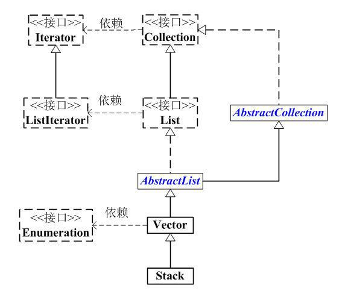

# Java Stack 类

*本文对应 https://github.com/hbulpf/JavaPrinciple*


栈是Vector的一个子类，它实现了一个标准的后进先出的栈。



堆栈只定义了默认构造函数，用来创建一个空栈。 堆栈除了包括由Vector定义的所有方法，也定义了自己的一些方法。

```
Stack()
```

除了由Vector定义的所有方法，自己也定义了一些方法：

| 序号 | 方法描述                                                     |
| :--- | :----------------------------------------------------------- |
| 1    | boolean empty()  测试堆栈是否为空。                          |
| 2    | Object peek( ) 查看堆栈顶部的对象，但不从堆栈中移除它。      |
| 3    | Object pop( ) 移除堆栈顶部的对象，并作为此函数的值返回该对象。 |
| 4    | Object push(Object element) 把项压入堆栈顶部。               |
| 5    | int search(Object element) 返回对象在堆栈中的位置，以 1 为基数。 |

## 示例

```
/**
 * 栈的使用
 *
 */
public class StackDemo {

    public static void main(String[] args) {
        basicTest();
        basicTest2();
    }

    public static void basicTest() {
        Stack<Integer> stack = new Stack<Integer>();
        stack.push(1);
        stack.push(3);
        stack.push(7);
        stack.push(2);
        int len = stack.size();
        for (int i = 0; i < len; i++) {
            System.out.printf("%4d",stack.pop());
        }
    }

    static void showpush(Stack<Integer> st, int a) {
        st.push(new Integer(a));
        System.out.println("push(" + a + ")");
        System.out.println("stack: " + st);
    }

    static void showpop(Stack<Integer> st) {
        System.out.print("pop -> ");
        Integer a = (Integer) st.pop();
        System.out.println(a);
        System.out.println("stack: " + st);
    }

    public static void basicTest2() {
        Stack<Integer> st = new Stack<Integer>();
        System.out.println("stack: " + st);
        showpush(st, 42);
        showpush(st, 66);
        showpush(st, 99);
        showpop(st);
        showpop(st);
        showpop(st);
        try {
            showpop(st);
        } catch (EmptyStackException e) {
            System.out.println("empty stack");
        }
    }
}
```

