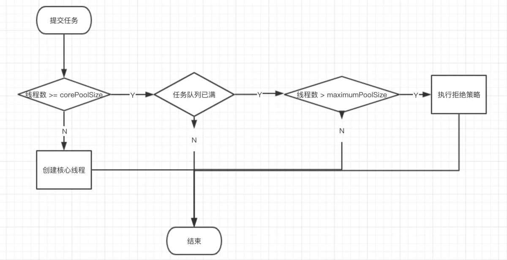
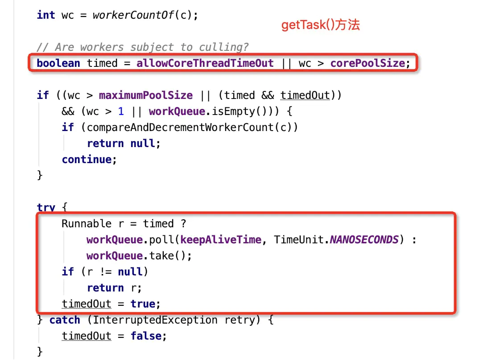

# 线程池

想要进阶自己的开发水平，JDK源码中一些优秀的设计必须要经常学习，哪怕不学习，应对面试的时候，还是要能够应对几招，代表自己对这些东西还是有所了解。

而线程池的源码，这块更是面试中经常被问到的东西，先试着列几个问题，看看自己对线程池的掌握程度：

1. 创建线程池的参数有哪些，分别代表什么意思？
2. 为什么阿里要求不能直接使用Executors工具类创建线程池？
3. 线程池线程的数量如何配置？
4. 一般线程池提交任务，执行任务的过程？
5. 线程池中ctl属性的作用是什么？
6. 线程池的状态有哪些？在什么时候下会出现？
7. 一般线程池中有哪些未实现的空方法，可以用做线程池的扩展？
8. 线程池中每一个具体的worker线程什么时候开始执行？执行的过程是什么？
9. 核心线程与非核心线程在线程池中是怎么区分的？
10. 线程池中的那个方法可以提前创建核心线程？
11. 什么情况下worker线程会退出？
12. 核心线程会不会退出？
13. 由于程序异常导致的退出和线程池内部机制导致的退出有什么区别？
14. 线程池shutdown与shutdownNow有什么区别？

### 常见问题

#### 使用线程池有哪些好处？

首先在开发的过程中，为什么需要线程池呢？给我们带来了那些好处

- 提高系统的响应速度
- 如果每次多线程操作都创建一个线程，会浪费时间和消耗系统资源，而线程池可以减少这些操作
- 可以对多个线程进行统一管理，统一调度，提高线程池的可管理性

#### 创建线程池的参数有哪些？

线程池是怎么创建的呢？一个是使用Executors，另外就是手动创建线程池，要了解其每个参数的含义。Executors创建线程池的话，要不就是对线程的数量没有控制，如CachedThreadPool，要不就是是无界队列，如FixedThreadPool。**对线程池数量和队列大小没有限制的话，容易导致OOM异常。**所以我们要自己手动创建线程池：

- corePoolSize：核心线程数量，默认情况下每提交一个任务就会创建一个核心线程，直到核心线程的数量等于corePoolSize就不再创建。**线程池提供了两个方法可以提前创建核心线程，`prestartAllCoreThreads()`提前创建所有的核心线程，`prestartCoreThread`，提前创建一个核心线程** 

- maximumPoolSize：线程池允许创建的最大线程数。只有当线程池队列满的时候才会创建

- keepAliveTime：线程池空闲状态可以等待的时间，默认对非核心线程生效，但是设置`allowCoreThreadTimeOut`的话对核心线程也生效

- unit: 保活时间的单位，创建线程池的时候，`keepAliveTime = unit.toNanos(keepAliveTime)` 

- workQueue: 任务队列，用于保持或等待执行的任务阻塞队列。BlockingQueue的实现类即可，有无界队列和有界队列 

  - ArrayBlockingQueue: 基于数组结构的有界队列，此队列按FIFO原则对元素进行排序
  - LinkedBlockingQueue: 基于链表的阻塞队列，FIFO原则，吞吐量通常高于ArrayBlockingQueue.
  - SynchronousQueue: 不存储元素的阻塞队列。每个插入必须要等到另一个线程调用移除操作。
  - PriorityBlockingQueue: 具有优先级的无阻塞队列

- threadFactory： 用于设置创建线程的工厂。

- handler：拒绝策略，当队列线程池都满了，必须采用一种策略来处理还要提交的任务。

  在实际应用中，我们可以将信息记录到日志，来分析系统的负载和任务丢失情况

  JDK中提供了4中策略： 

  - AbortPolicy: 直接抛出异常
  - CallerRunsPolicy: 只用调用者所在的线程来运行任务
  - DiscardOldestPolicy： 丢弃队列中最老的一个人任务，并执行当前任务。
  - DiscardPolicy: 直接丢弃新进来的任务

#### 线程池提交任务的过程？

可以使用两个方法执行任务：

- execute() 提交不需要返回值的任务，无法判断是否执行成功，具体步骤上面我们有分析
- submit() 提交有返回值的任务，该方法返回一个future的对象，通过future对象可以判断任务是否执行成功。future的get方法会阻塞当前线程直到任务完成。 
  - submit内部使用RunnableFuture对任务进行封装

整体分为三个步骤：

1. 判断当前线程数是否小于corePoolSize，如果小于，则新建核心线程，不管核心线程是否处于空闲状态
2. 核心线程创建满之后，后续的任务添加到workQueue中
3. 如果workQueue满了，则开始创建非核心线程直到线程的总数为maximumPoolSize
4. 当非核心线程数也满了，队列也满了的时候，执行拒绝策略

中间会有一些对当前线程池的检查操作。




#### 线程池数量如何配置？

- 任务性质：CPU密集，IO密集，和混合密集
- 任务执行时间：长，中，低
- 任务优先级：高，中，低
- 任务的依赖性：是否依赖其它资源，如数据库连接

在代码中可以通过：`Runtime.getRuntime().availableProcessors();`获取CPU数量。线程数计算公式：


```bash
N = CPU数量
U = 目标CPU使用率，  0 <= U <= 1
W/C = 等待(wait)时间与计算(compute)时间的比率

线程池数量 =  N * U * (1 + W/C)
```

不过最简单的线程数指定方式，不需要公式的话：

- CPU密集型，创建线程数为`CPU核数 + 1` 
- IO密集型，线程数最好为`CPU核数 * n`，耗时越久，分配线程数多一些

#### 线程池的状态有哪些？

线程池的状态主要通过ctl属性来控制，通过ctl可以计算出：

- 当前线程池状态
- 当前线程的数量

计算规则主要是利用了按位操作：


```java
11100000000000000000000000000000   RUNNING
00000000000000000000000000000000   SHUTDOWN
00100000000000000000000000000000   STOP
01000000000000000000000000000000   TYDYING
01100000000000000000000000000000   TERMINATED


11100000000000000000000000000000   ctl初始值
11100000000000000000000000000000  ~CAPACITY  
private static int runStateOf(int c)     { return c & ~CAPACITY; }

11100000000000000000000000000000   ctl初始值
00011111111111111111111111111111  CAPACITY
private static int workerCountOf(int c)  { return c & CAPACITY; }
    
private static int ctlOf(int rs, int wc) { return rs | wc; }  
```

- RUNNING：运行状态，接受新任务，持续处理任务队列里的任务。
- SHUTDOWN：调用shutdown()方法会进入此状态，不再接受新任务，但要处理任务队列里的任务
- STOP：调用shutdownNow()方法，不再接受新任务，不再处理任务队列里的任务，中断正在进行中的任务
- TIDYING：表示线程池正在停止运作，中止所有任务，销毁所有工作线程。
- TERMINATED：表示线程池已停止运作，所有工作线程已被销毁，所有任务已被清空或执行完毕


```java
    private final AtomicInteger ctl = new AtomicInteger(ctlOf(RUNNING, 0));
    private static final int COUNT_BITS = Integer.SIZE - 3;
    private static final int CAPACITY   = (1 << COUNT_BITS) - 1;

    // runState is stored in the high-order bits
    private static final int RUNNING    = -1 << COUNT_BITS;
    private static final int SHUTDOWN   =  0 << COUNT_BITS;
    private static final int STOP       =  1 << COUNT_BITS;
    private static final int TIDYING    =  2 << COUNT_BITS;
    private static final int TERMINATED =  3 << COUNT_BITS;
```

关于TIDYING和TERMINATED主要有一块代码区，可以看出来TIDYING状态紧接着就是TERMINATED。


```kotlin
                        if (ctl.compareAndSet(c, ctlOf(TIDYING, 0))) {
                    try {
                            // 默认是空方法
                        terminated();
                    } finally {
                        ctl.set(ctlOf(TERMINATED, 0));
                        termination.signalAll();
                    }
                    return;
                }
```

#### 线程池提供的扩展方法有哪些？

默认有三个扩展方法，可以用来做一些线程池运行状态统计，监控：


```cpp
 protected void beforeExecute(Thread t, Runnable r) { }  // task.run方法之前执行
 protected void afterExecute(Runnable r, Throwable t) { }  // task执行完之后，不管有没有异常都会执行
 protected void terminated() { }  
```

默认线程池也提供了几个相关的可监控属性：

- taskCount: 线程池需要执行的任务数量
- completedTaskCount: 已经完成的任务数量
- largestPoolSize: 线程池中曾经创建的最大的线程数量
- getPoolSize: 线程池的线程数量
- getActiveCount: 活动的线程数

#### 线程池中的Worker线程执行的过程？

Worker类实现了Runnable方法，**在成功创建Worker线程后就会调用其start方法。**


```kotlin
w = new Worker(firstTask);
final Thread t = w.thread;   //理解为 w.thread = new Thread(w)
if (workerAdded) {
    t.start();
    workerStarted = true;
}


Worker(Runnable firstTask) {
    setState(-1); // inhibit interrupts until runWorker
    this.firstTask = firstTask;
    this.thread = getThreadFactory().newThread(this);
}
```

Worker线程运行时执行runWorker方法，里面主要事情：

- 如果构造Worker的时候，指定了firstTask，那么首先执行firstTask，否则从队列中获取任务
- Worker线程会循环的getTask()，然后去执行任务
- 如果getTask()为空，那么worker线程就会退出
- 在任务执行前后，可以自定义扩展beforeExecute与afterExecute方法
- 如果检测到线程池为STOP状态，并且线程还没有被中断过的话，进行中断处理

简单来说就是不断的从任务队列中取任务，如果取不到，那么就退出当前的线程，取到任务就执行任务。


```csharp
    final void runWorker(Worker w) {
        Thread wt = Thread.currentThread();
        
        Runnable task = w.firstTask;
        w.firstTask = null;
        w.unlock(); // allow interrupts
        // 代表着Worker是否因为用户的程序有问题导致的死亡
        boolean completedAbruptly = true;
        try {
            while (task != null || (task = getTask()) != null) {
                w.lock();
                // If pool is stopping, ensure thread is interrupted;
                // if not, ensure thread is not interrupted.  This
                // requires a recheck in second case to deal with
                // shutdownNow race while clearing interrupt
                if ((runStateAtLeast(ctl.get(), STOP) ||
                     (Thread.interrupted() &&
                      runStateAtLeast(ctl.get(), STOP))) &&
                    !wt.isInterrupted())
                    wt.interrupt();
                try {
                    beforeExecute(wt, task);
                    Throwable thrown = null;
                    try {
                        task.run();
                    } catch (Exception x) {
                                                  //... 不同的异常处理
                    } finally {
                        afterExecute(task, thrown);
                    }
                } finally {
                    task = null;
                    w.completedTasks++;
                    w.unlock();
                }
            }
            completedAbruptly = false;
        } finally {
            processWorkerExit(w, completedAbruptly);
        }
    }
```

#### 线程池如何区分核心线程与非核心线程？

实际上内部在创建线程时，并没有给线程做标记，因此无法区分核心线程与非核心线程。可以看出`addWorker()方法`。

但是为什么可以保持核心线程一直不被销毁呢？

其内部主要根据当前线程的数量来处理。**也可以理解为，只要当前的worker线程数小于配置的corePoolSize，那么这些线程都是核心线程。线程池根据当前线程池的数量来判断要不要退出线程，而不是根据是否核心线程**

#### 核心线程能否被退出？

上面一个问题我们说到了内部其实不区分核心线程与非核心线程的，只是根据数量来判断是否退出线程，但是线程是如何退出的，又是如何一直处于保活状态呢？

**如果配置了allowCoreThreadTimeOut，代表核心线程在配置的keepAliveTime时间内没获取到任务，会执行退出操作。也就是尽管当前线程数量小于corePoolSize也会执行退出线程操作。**

workQueue.take()方法会一直阻塞当前的队列直到有任务的出现，因此如果执行的是take方法，那么当前的线程就不会退出。想要退出当前的线程，有几个条件：

- 1 当前的worker数量大于maximumPoolSize的worker数量。

- 2 线程池当前处于STOP状态，即shutdownNow

- 3 线程池处于SHUTDOWN状态，并且当前的队列为空

- 4 worker线程等待task超时了，并且当前的worker线程配置为可以被退出。

  ```
  timed=true
  ```

  - allowCoreThreadTimeOut配置为true
  - 线程数量大于核心线程数



image-20200212092008155.png

#### 如何提前创建核心线程数？

上面提到了，有两个方法：

-  `prestartAllCoreThreads()`提前创建所有的核心线程
-  `prestartCoreThread`，提前创建一个核心线程，如果当前线程数量大于corePoolSize，则不创建

#### 线程池异常退出与自动退出的区别？

如果线程是由于程序异常导致的退出，那么completedAbruptly为true，如下代码会再新建一个Worker线程。

如果线程是系统自动退出，即completedAbruptly为false的话，会根据配置判断当前可以允许的最小核心线程数量

- 配置allowCoreThreadTimeOut为true的话，最小核心线程数可以为0。
- 默认情况下最小线程数为corePoolSize


```swift
int c = ctl.get();
        if (runStateLessThan(c, STOP)) {
            if (!completedAbruptly) {
                int min = allowCoreThreadTimeOut ? 0 : corePoolSize;
                if (min == 0 && ! workQueue.isEmpty())
                    min = 1;
                if (workerCountOf(c) >= min)
                    return; // replacement not needed
            }
            addWorker(null, false);
        }
```

#### 线程池shutdown与shutdownNow有什么区别？

看代码主要三个区别：

- shutdown会把线程池的状态改为SHUTDOWN，而shutdownNow把当前线程池状态改为STOP
- shutdown只会中断所有空闲的线程，而shutdownNow会中断所有的线程。
- shutdown返回方法为空，会将当前任务队列中的所有任务执行完毕；而shutdownNow把任务队列中的所有任务都取出来返回。


### 最后

学无止境，还有很多细节，但足以打动面试官，觉得真是一个很用心的候选人呢... 希望这些能帮到你。

# 参考

- [聊聊线程池，这一顿操作说懵阿里面试官...](https://www.jianshu.com/p/58f6507fb75a)

