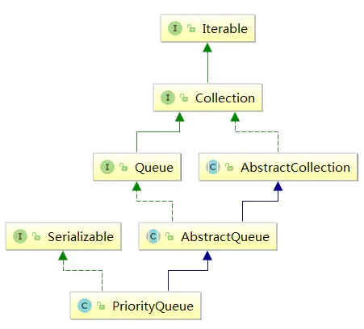

# PriorityQueue详解

## 概念

PriorityQueue 一个基于优先级的无界优先级队列。优先级队列的元素按照其自然顺序进行排序，或者根据构造队列时提供的 Comparator 进行排序，具体取决于所使用的构造方法。该队列不允许使用 null 元素也不允许插入不可比较的对象(没有实现Comparable接口的对象)。

PriorityQueue 队列的头指排序规则最小那哥元素。如果多个元素都是最小值则随机选一个。

PriorityQueue 是一个无界队列，但是初始的容量(实际是一个Object[])，随着不断向优先级队列添加元素，其容量会自动扩容，无需指定容量增加策略的细节。




## 基本使用

PriorityQueue使用跟普通队列一样，唯一区别是PriorityQueue会根据排序规则决定谁在队头，谁在队尾。
 往队列中添加可比较的对象String


```csharp
public class App {
    public static void main(String[] args) {
        PriorityQueue<String> q = new PriorityQueue<String>();
        //入列
        q.offer("1");
        q.offer("2");
        q.offer("5");
        q.offer("3");
        q.offer("4");

        //出列
        System.out.println(q.poll());  //1
        System.out.println(q.poll());  //2
        System.out.println(q.poll());  //3
        System.out.println(q.poll());  //4
        System.out.println(q.poll());  //5
    }
}
```

观察打印结果， 入列：12534， 出列是12345， 也是说出列时做了相关判断，将最小的值返回。默认情况下PriorityQueue使用自然排序法，最小元素先出列。
 自定义排序规则


```cpp
public class Student {
    private String name;  //名字
    private int score;    //分数
   //省略getter/setter
}
```


```csharp
public class App {
    public static void main(String[] args) {
        //通过改造器指定排序规则
        PriorityQueue<Student> q = new PriorityQueue<Student>(new Comparator<Student>() {
            public int compare(Student o1, Student o2) {
                //按照分数低到高，分数相等按名字
                if(o1.getScore() == o2.getScore()){
                    return o1.getName().compareTo(o2.getName());
                }
                return o1.getScore() - o2.getScore();
            }
        });
        //入列
        q.offer(new Student("dafei", 20));
        q.offer(new Student("will", 17));
        q.offer(new Student("setf", 30));
        q.offer(new Student("bunny", 20));

        //出列
        System.out.println(q.poll());  //Student{name='will', score=17}
        System.out.println(q.poll());  //Student{name='bunny', score=20}
        System.out.println(q.poll());  //Student{name='dafei', score=20}
        System.out.println(q.poll());  //Student{name='setf', score=30}
    }
}
```

PriorityQueue优先级规则可以由我们根据具体需求而定制， 方式有2种：
 1、添加元素自身实现了Comparable接口，确保元素是可排序的对象
 2、如果添加元素没有实现Comparable接口，可以在创建PriorityQueue队列时直接指定比较器。

## 源码解析

PriorityQueue 是怎么实现优先级队列的呢？

```java
public class PriorityQueue<E> extends AbstractQueue<E>
    implements java.io.Serializable {
    transient Object[] queue;    //队列容器， 默认是11
    private int size = 0;  //队列长度
    private final Comparator<? super E> comparator;  //队列比较器， 为null使用自然排序
    //....
}
```

入列


```cpp
    public boolean offer(E e) {
        if (e == null)
            throw new NullPointerException();
        modCount++;
        int i = size;
        if (i >= queue.length)
            grow(i + 1);      //当队列长度大于等于容量值时，自动拓展
        size = i + 1;
        if (i == 0)
            queue[0] = e;
        else
            siftUp(i, e); //
        return true;
    }
```


```csharp
    private void siftUp(int k, E x) {
        if (comparator != null)
            siftUpUsingComparator(k, x);   //指定比较器
        else
            siftUpComparable(k, x);   //没有指定比较器，使用默认的自然比较器
    }
```


```cpp
    private void siftUpComparable(int k, E x) {
        Comparable<? super E> key = (Comparable<? super E>) x;
        while (k > 0) {
            int parent = (k - 1) >>> 1;
            Object e = queue[parent];
            if (key.compareTo((E) e) >= 0)
                break;
            queue[k] = e;
            k = parent;
        }
        queue[k] = key;
    }
```


```cpp
    private void siftUpUsingComparator(int k, E x) {
        while (k > 0) {
            int parent = (k - 1) >>> 1;
            Object e = queue[parent];
            if (comparator.compare(x, (E) e) >= 0)
                break;
            queue[k] = e;
            k = parent;
        }
        queue[k] = x;
    }
```

这里自作简单比较，使用选择排序法将入列的元素放左边或者右边.
 从源码上看PriorityQueue的入列操作并没对所有加入的元素进行优先级排序。仅仅保证数组第一个元素是最小的即可。
 出列


```cpp
    public E poll() {
        if (size == 0)
            return null;
        int s = --size;
        modCount++;
        E result = (E) queue[0];
        E x = (E) queue[s];
        queue[s] = null;
        if (s != 0)
            siftDown(0, x);
        return result;
    }
```


```csharp
    private void siftDown(int k, E x) {
        if (comparator != null)
            siftDownUsingComparator(k, x);  //指定比较器
        else
            siftDownComparable(k, x);    //默认比较器
    }
```


```cpp
private void siftDownComparable(int k, E x) {
        Comparable<? super E> key = (Comparable<? super E>)x;
        int half = size >>> 1;        // loop while a non-leaf
        while (k < half) {
            int child = (k << 1) + 1; // assume left child is least
            Object c = queue[child];
            int right = child + 1;
            if (right < size &&
                ((Comparable<? super E>) c).compareTo((E) queue[right]) > 0)
                c = queue[child = right];
            if (key.compareTo((E) c) <= 0)
                break;
            queue[k] = c;
            k = child;
        }
        queue[k] = key;
    }

    @SuppressWarnings("unchecked")
    private void siftDownUsingComparator(int k, E x) {
        int half = size >>> 1;
        while (k < half) {
            int child = (k << 1) + 1;
            Object c = queue[child];
            int right = child + 1;
            if (right < size &&
                comparator.compare((E) c, (E) queue[right]) > 0)
                c = queue[child = right];
            if (comparator.compare(x, (E) c) <= 0)
                break;
            queue[k] = c;
            k = child;
        }
        queue[k] = x;
    }
```

上面源码，当第一个元素出列之后，对剩下的元素进行再排序，挑选出最小的元素排在数组第一个位置。

通过上面源码，也可看出PriorityQueue并不是线程安全队列，因为offer/poll都没有对队列进行锁定，所以，如果要拥有线程安全的优先级队列，需要额外进行加锁操作。

## 总结

1、PriorityQueue是一种无界的，线程不安全的队列

2、PriorityQueue是一种通过数组实现的，并拥有优先级的队列

3、PriorityQueue存储的元素要求必须是可比较的对象， 如果不是就必须明确指定比较器
 
 # 参考
 
 