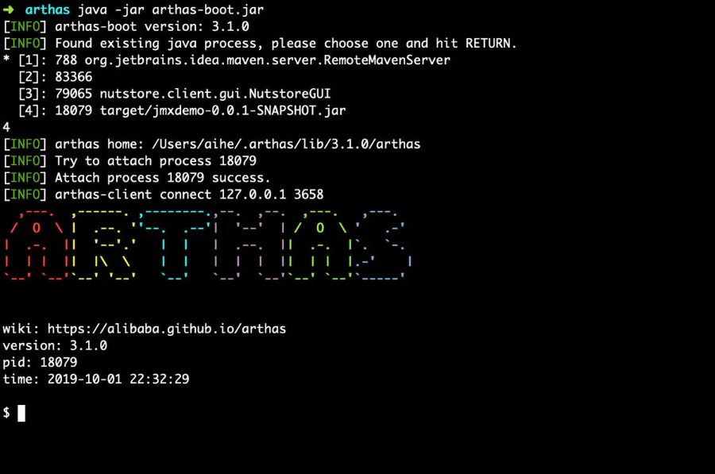
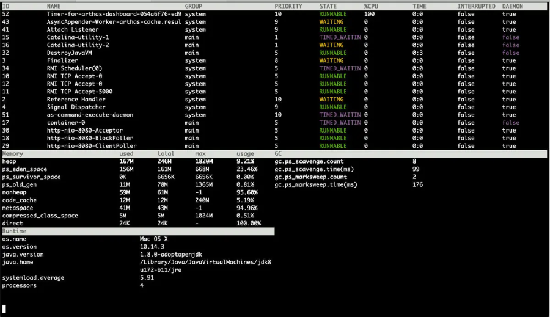

# 介绍一款JVM神器：Arthas

[Arthas](https://alibaba.github.io/arthas/) 是阿里开源的一款好用的jvm监控工具，有点像是把jdk中自带的命令行工具做了集合, 堪称​JVM 问题定位的神器。​

当遇到以下类似问题而束手无策时，Arthas 可以帮助你解决：

1. 这个类从哪个 jar 包加载的？为什么会报各种类相关的 Exception？
2. 我改的代码为什么没有执行到？难道是我没 commit？分支搞错了？
3. 遇到问题无法在线上 debug，难道只能通过加日志再重新发布吗？
4. 线上遇到某个用户的数据处理有问题，但线上同样无法 debug，线下无法重现！
5. 是否有一个全局视角来查看系统的运行状况？
6. 有什么办法可以监控到JVM的实时运行状态？

Arthas 采用命令行交互模式，同时提供丰富的 Tab 自动补全功能，进一步方便进行问题的定位和诊断。

## 安装

```php
# 安装方式一
curl -L https://alibaba.github.io/arthas/install.sh | sh
# 安装方式二
java -jar arthas-boot.jar --repo-mirror aliyun --use-http
```

## 启动

启动 arthas-boot.jar
```css
java -jar arthas-boot.jar
```





## 使用

### 基础命令

- help——查看命令帮助信息
- [cat](https://alibaba.github.io/arthas/cat.html)——打印文件内容，和linux里的cat命令类似
- [echo](https://alibaba.github.io/arthas/echo.html)–打印参数，和linux里的echo命令类似
- [grep](https://alibaba.github.io/arthas/grep.html)——匹配查找，和linux里的grep命令类似
- [tee](https://alibaba.github.io/arthas/tee.html)——复制标准输入到标准输出和指定的文件，和linux里的tee命令类似
- [pwd](https://alibaba.github.io/arthas/pwd.html)——返回当前的工作目录，和linux命令类似
- cls——清空当前屏幕区域
- session——查看当前会话的信息
- [reset](https://alibaba.github.io/arthas/reset.html)——重置增强类，将被 Arthas 增强过的类全部还原，Arthas 服务端关闭时会重置所有增强过的类
- version——输出当前目标 Java 进程所加载的 Arthas 版本号
- history——打印命令历史
- quit——退出当前 Arthas 客户端，其他 Arthas 客户端不受影响
- stop——关闭 Arthas 服务端，所有 Arthas 客户端全部退出
- [keymap](https://alibaba.github.io/arthas/keymap.html)——Arthas快捷键列表及自定义快捷键

### jvm相关

- [dashboard](https://alibaba.github.io/arthas/dashboard.html)——当前系统的实时数据面板
- [thread](https://alibaba.github.io/arthas/thread.html)——查看当前 JVM 的线程堆栈信息
- [jvm](https://alibaba.github.io/arthas/jvm.html)——查看当前 JVM 的信息
- [sysprop](https://alibaba.github.io/arthas/sysprop.html)——查看和修改JVM的系统属性
- [sysenv](https://alibaba.github.io/arthas/sysenv.html)——查看JVM的环境变量
- [vmoption](https://alibaba.github.io/arthas/vmoption.html)——查看和修改JVM里诊断相关的option
- [perfcounter](https://alibaba.github.io/arthas/perfcounter.html)——查看当前 JVM 的Perf Counter信息
- [logger](https://alibaba.github.io/arthas/logger.html)——查看和修改logger
- [getstatic](https://alibaba.github.io/arthas/getstatic.html)——查看类的静态属性
- [ognl](https://alibaba.github.io/arthas/ognl.html)——执行ognl表达式
- [mbean](https://alibaba.github.io/arthas/mbean.html)——查看 Mbean 的信息
- [heapdump](https://alibaba.github.io/arthas/heapdump.html)——dump java heap, 类似jmap命令的heap dump功能

### class/classloader相关

- [sc](https://alibaba.github.io/arthas/sc.html)——查看JVM已加载的类信息
- [sm](https://alibaba.github.io/arthas/sm.html)——查看已加载类的方法信息
- [jad](https://alibaba.github.io/arthas/jad.html)——反编译指定已加载类的源码
- [mc](https://alibaba.github.io/arthas/mc.html)——内存编译器，内存编译`.java`文件为`.class`文件
- [redefine](https://alibaba.github.io/arthas/redefine.html)——加载外部的`.class`文件，redefine到JVM里
- [dump](https://alibaba.github.io/arthas/dump.html)——dump 已加载类的 byte code 到特定目录
- [classloader](https://alibaba.github.io/arthas/classloader.html)——查看classloader的继承树，urls，类加载信息，使用classloader去getResource

### monitor/watch/trace相关

> 请注意，这些命令，都通过字节码增强技术来实现的，会在指定类的方法中插入一些切面来实现数据统计和观测，因此在线上、预发使用时，请尽量明确需要观测的类、方法以及条件，诊断结束要执行 `stop` 或将增强过的类执行 `reset` 命令。

- [monitor](https://alibaba.github.io/arthas/monitor.html)——方法执行监控
- [watch](https://alibaba.github.io/arthas/watch.html)——方法执行数据观测
- [trace](https://alibaba.github.io/arthas/trace.html)——方法内部调用路径，并输出方法路径上的每个节点上耗时
- [stack](https://alibaba.github.io/arthas/stack.html)——输出当前方法被调用的调用路径
- [tt](https://alibaba.github.io/arthas/tt.html)——方法执行数据的时空隧道，记录下指定方法每次调用的入参和返回信息，并能对这些不同的时间下调用进行观测

### profiler/火焰图

- [profiler](https://alibaba.github.io/arthas/profiler.html)——使用[async-profiler](https://github.com/jvm-profiling-tools/async-profiler)对应用采样，生成火焰图

### options

- [options](https://alibaba.github.io/arthas/options.html)——查看或设置Arthas全局开关

### 管道

Arthas支持使用管道对上述命令的结果进行进一步的处理，如`sm java.lang.String * | grep 'index'`

- grep——搜索满足条件的结果
- plaintext——将命令的结果去除ANSI颜色
- wc——按行统计输出结果

### 后台异步任务

当线上出现偶发的问题，比如需要watch某个条件，而这个条件一天可能才会出现一次时，异步后台任务就派上用场了，详情请参考[这里](https://alibaba.github.io/arthas/async.html)

- 使用 > 将结果重写向到日志文件，使用 & 指定命令是后台运行，session断开不影响任务执行（生命周期默认为1天）
- jobs——列出所有job
- kill——强制终止任务
- fg——将暂停的任务拉到前台执行
- bg——将暂停的任务放到后台执行

### Web Console

通过websocket连接Arthas。

- [Web Console](https://alibaba.github.io/arthas/web-console.html)

### 以java agent方式启动

- [以java agent方式启动](https://alibaba.github.io/arthas/agent.html)

### 用户数据回报

在`3.1.4`版本后，增加了用户数据回报功能，方便统一做安全或者历史数据统计。

在启动时，指定`stat-url`，就会回报执行的每一行命令，比如： `./as.sh --stat-url 'http://192.168.10.11:8080/api/stat'`

在tunnel server里有一个示例的回报代码，用户可以自己在服务器上实现。

[StatController.java](https://github.com/alibaba/arthas/blob/master/tunnel-server/src/main/java/com/alibaba/arthas/tunnel/server/app/web/StatController.java)

### 其他特性

- [异步命令支持](https://alibaba.github.io/arthas/async.html)
- [执行结果存日志](https://alibaba.github.io/arthas/save-log.html)
- [批处理的支持](https://alibaba.github.io/arthas/batch-support.html)
- [ognl表达式的用法说明](https://github.com/alibaba/arthas/issues/11)

## 使用arthas的几点建议与忠告：

1. trace/stack 记得加 `-n` 参数，防止终端被打印信息撑爆，
2. 对于调用比较频繁的方法，添加严格的过滤条件
3. 修改代码的功能不要在生产环境使用，这会引发意想不到的问题
4. 可能需要使用arthas改值的基础类型成员，不要用 `static final` 修饰符,因为这种数据在编译期会被优化掉,就算使用arthas修改数据也无法在使用的地方生效
5. 使用spring的工程，可以添加SpringContext，这为对spring对象操作做下了关键铺垫点
6. 方法不要太长，否则关键时刻使用arthas找不到调试点 

## 其他

[arthas技能图谱](imgs/arthas3.png)

# 参考

1. [Arthas官方文档](https://alibaba.github.io/arthas/)
2. [Ognl表达式基本原理和使用方法](https://www.cnblogs.com/cenyu/p/6233942.html)
3. [OGNL表达式官方指南](https://commons.apache.org/proper/commons-ognl/language-guide.html )
