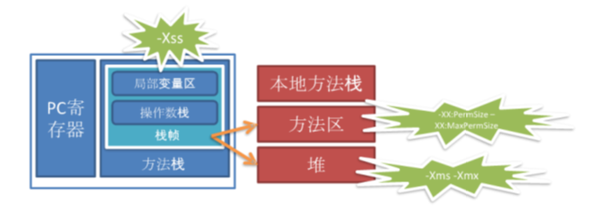

# JVM系列:(1)JVM内存组成

> JVM虚拟机是Java应用的核心，本文主要讲了JVM的基本组成以及 -Xss/-Xms/-XX:PermSize等简单的调优参数。

## 堆(Heap)和非堆(Non-heap)内存

Java 虚拟机有一个堆，堆是运行时数据区域，所有类实例和数组的内存均从此处分配。堆是在 Java 虚拟机启动时创建的。在JVM中堆之外的内存称为非堆内存(Non-heap memory)。

因此JVM主要管理两种类型的内存：堆和非堆。

简单来说，堆就是Java代码可及的内存，是留给开发人员使用的；非堆就是JVM留给自己用的。

所以方法区、JVM内部处理或优化所需的内存(如JIT编译后的代码缓存)、每个类结构(如运行时常量池、字段和方法数据)以及方法和构造方法的代码都在非堆内存中。

基本组成如下图

- 方法栈&本地方法栈: 线程创建时产生,方法执行时生成栈帧 (-Xss)
- 方法区: 存储类的元数据信息常量等 (-XX:PermSize,-XX:MaxPermSize)
- 堆: java代码中所有的new操作 (-Xms,-Xmx)
- native Memory(C heap): Direct Bytebuffer JNI Compile GC

## 堆内存分配

JVM初始分配的内存由-Xms指定，默认是物理内存的1/64; JVM最大分配的内存由-Xmx指定，默认是物理内存的1/4。
默认空余堆内存小于40%时，JVM就会增大堆直到-Xmx的最大限制；空余堆内存大于70%时，JVM会减少堆直到 -Xms 的最小限制。

因此服务器一般设置-Xms、-Xmx相等以避免在每次GC后调整堆的大小。对象的堆内存由称为垃圾回收器的自动内存管理系统回收。

 

| 组成             | 详解                                 |
| ---------------- | ------------------------------------ |
| Young Generation | Eden + From Space(S0) + To Space(S1) |
| Eden             | 存放新生的对象                       |
| Survivor Space   | 有两个，存放每次垃圾回收后存活的对象 |
| Old Generation   | 存放应用程序中生命周期长的存活对象   |

## 非堆内存分配

JVM使用 `-XX:PermSize` 设置非堆内存初始值，默认是物理内存的1/64；由 `-XX:MaxPermSize` 设置最大非堆内存的大小，默认是物理内存的1/4。

| 组成                 | 详解                                                         |
| -------------------- | ------------------------------------------------------------ |
| Permanent Generation | 保存虚拟机自己的静态(refective)数据 主要存放加载的Class类级别静态对象如class本身，method，field等等 permanent generation空间不足会引发full GC |
| Code Cache           | 用于编译和保存本地代码（native code）的内存 JVM内部处理或优化 |

##  JVM内存限制(最大值)

JVM内存的最大值跟操作系统有很大的关系。

简单的说就32位处理器支持最大内存空间有4GB,但是具体的操作系统会给一个限制，这个限制一般是2GB-3GB（一般来说Windows系统下为1.5G-2G，Linux系统下为2G-3G），而64bit以上的处理器就不会有限制了。
