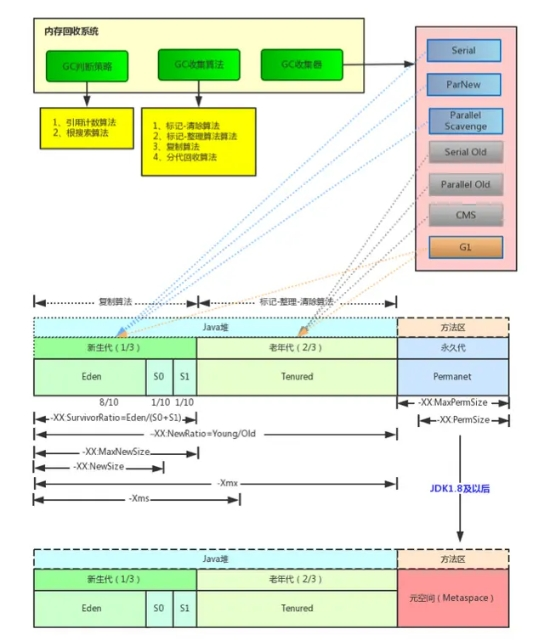

# JVM系列:(2)HotSpot垃圾收集器的种类

> JVM垃圾收集器是GC过程的核心组件，本文以HotSpot虚拟机为例，主要介绍 serial collector、parallel collector、concurrent collector 3种垃圾收集器并比较了他们的区别。

## Collector种类   

GC在 HotSpot VM 5.0里有四种：incremental low pause collector、 serial collector、parallel collector、concurrent collector

incremental (sometimes called train) low pause collector 已被废弃,不再介绍.

### serial collector

**单线程收集器** 使用单线程去完成所有的gc工作，没有线程间的通信，这种方式会相对高效

#### 使用场景

单处理器机器且没有pause time的要求    

#### 使用方法

Client模式下默认可用

可用`-XX:+UseSerialGC` 强制使用 

**优点**: 对server应用没什么优点 

**缺点**: 慢,不能充分发挥硬件资源

#### 内存回收何时触发

**YGC** : eden空间不足时​

**FGC**

1. old空间不足
2. perm空间不足 
3. 显示调用System.gc() ,包括RMI等的定时触发
4. YGC时的悲观策略 
5. dump live的内存信息时(jmap –dump:live) 

#### 内存回收时发生了什么

**YGC**
1. 清空eden+S0中所有no ref的对象占用的内存，将eden+S0中的所有存活的对象copy到S1空间中,在这个过程中一些对象将晋升到old中，如S1放不下的。
2. 存活次数超过tenuring threshold的，重新计算Tenuring Threshold; 
3. 单线程做以上动作,全程暂停应用

**FGC**
1. 如果配置了CollectGen0First,则先触发YGC
2. 清空heap中no ref的对象,永久代中已经被卸载的classloader中加载的class的信息
3. 单线程做以上动作,全程暂停应用

#### 细节参数

* `-XX:+UseSerialGC` 强制使用SerialGC 
* `-XX:SurvivorRatio=x` 控制eden/s0/s1的大小， 默认为8，也就是说Eden占新生代的8/10，From幸存区和To幸存区各占新生代的1/10
* `-XX:MaxTenuringThreshold` 控制对象在新生代存活的最大次数 
* `-XX:PretenureSizeThreshold=x` 控制超过多大的字节的对象就在old分配. 
* `-XX:SurvivorRatio=x` 控制eden/s0/s1的大小 
* `-XX:MaxTenuringThreshold` 控制对象在新生代存活的最大次数 
* `-XX:UseAdaptiveSizePolicy` YGC后动态调整eden S0已经tenuringthreshold的动作
* `-XX:ParallelGCThreads` 设置并行的线程数

### parallel collector(throughput collector)   

**并行收集器** 使用多线程的方式，利用多CPU来提高GC的效率 主要以到达一定的吞吐量为目标

#### 使用场景

适用于科学技术和后台处理 有中规模/大规模数据集大小的应用且运行在多处理器上，关注吞吐量(throughput) 

#### 使用方法

* Server模式下默认 `--YGC:PS FGC:Parallel MSC`
* 可用`-XX:+UseParallelGC` 或 `-XX:+UseParallelOldGC` 强制指定
* `--ParallelGC` 代表FGC为Parallel MSC
* `--ParallelOldGC` 代表FGC为Parallel Compacting

优点:高效

缺点:当heap变大后,造成的暂停时间会变得比较长

#### 内存回收何时触发

**YGC** : eden空间不足时
 

**FGC**
 
1. old空间不足
2. perm空间不足 
3. 显示调用System.gc() ,包括RMI等的定时触发
4. YGC的悲观策略
5. dump live的内存信息时(jmap –dump:live) 

#### 内存回收时发生了什么

**YGC** 同serial动作基本相同,不同点: 

1. 多线程处理 
2. YGC最后不仅重新计算Tenuring Threshold,还会重新调整Eden和S0的大小
 
**FGC**
1. 如配置了ScavengeBeforeFullGC(默认),则先触发YGC
2. MSC:清空heap中的no ref对象,永久代中已经被卸载的classloader中加载的class信息,并进行压缩 
3. Compacting:清空heap中部分no ref的对象,永久代中已经被卸载的classloader中加载的class信息,并进行部分压缩 多线程做以上动作.

#### 细节参数

* `-XX:SurvivorRatio=x`  控制eden/s0/s1的大小
* `-XX:MaxTenuringThreshold`  用于控制对象在新生代存活的最大次数 
* `-XX:UseAdaptiveSizePolicy` 去掉YGC后动态调整eden、S0已经tenuringthreshold的动作
* `-XX:ParallelGCThreads` 设置并行的线程数

### concurrent collector(concurrent low pause collector)

**并发收集器** 使用多线程的方式,利用多CPU来提高GC的效率 并发完成大部分工作，使得gc pause缩短 

#### 使用场景

适合中规模/大规模数据集大小的应用，应用服务器,电信领域 关注response time，而不是throughput 

#### 使用方法

可用 `-XX:+UseConcMarkSweepGC` 强制指定 

**优点**: 对old进行回收时,对应用造成的暂停时间非常短,适合对latency要求比较高的应用 

**缺点**:

1. 内存碎片和浮动垃圾
2. old区的内存分配效率低
3. 回收的整个耗时比较长
4. 和应用争抢CPU

#### 内存回收何时触发

**YGC** : eden空间不足时
 

**CMS GC**
 
1. old Gen的使用率达到一定的比率 默认为92% 
2. 配置了CMSClassUnloadingEnabled,且Perm Gen的使用达到一定的比率 默认为92% 
3. Hotspot自己根据估计决定是否要触发
4. 在配置了ExplictGCInvokesConcurrent的情况下显示调用了System.gc.

**Full GC(Serial MSC)** : promotion failed 或 concurrent Mode Failure时

#### 内存回收时发生了什么

**YGC** 同serial动作基本相同,不同点：多线程处理
 
**CMSGC**

1. old gen到达比率时只清除old gen中no ref的对象所占用的空间 
2. perm gen到达比率时只清除已被清除的classloader加载的class信息


**FGC** 同serial

#### 细节参数

* `-XX:CMSInitiatingOcCPUancyFraction` 设置old gen使用到达多少比率时触发 
* `-XX:CMSInitiatingPermOcCPUancyFraction` 设置Perm Gen使用到达多少比率时触发 
* `-XX:+UseCMSInitiatingOcCPUancyOnly` 禁止hostspot自行触发CMS GC 




注：

- throughput collector与concurrent low pause collector的区别是throughput collector只在young area使用使用多线程，而concurrent low pause collector则在tenured generation也使用多线程。
- 根据官方文档，他们俩个需要在多CPU的情况下，才能发挥作用。在一个CPU的情况下，会不如默认的serial collector，因为线程管理需要耗费CPU资源。而在两个CPU的情况下，也提高不大。只是在更多CPU的情况下，才会有所提高。当然 concurrent low pause collector有一种模式可以在CPU较少的机器上，提供尽可能少的停顿的模式。
- 当要使用throughput collector时，在JVM启动参数里加上 `-XX:+UseParallelGC` ，启动 throughput collector 收集。也可加上 `-XX:ParallelGCThreads=<desired number>` 来改变线程数。还有两个参数 `-XX:MaxGCPauseMillis=<nnn>` 和 `-XX:GCTimeRatio=<nnn>` ，`-XX:MaxGCPauseMillis=<nnn>` 用来控制最大暂停时间，而 `-XX: GCTimeRatio` 可以提高GC说占CPU的比，以最大话的减小heap。

**附注SUN的官方说明**： 

> 1. The throughput collector: this collector uses a parallel version of the young generation collector. It is used if the -XX:+UseParallelGC option is passed on the command line. The tenured generation collector is the same as the serial collector.
>
> 2. The concurrent low pause collector: this collector is used if the -Xincgc™ or -XX:+UseConcMarkSweepGC is passed on the command line. The concurrent collector is used to collect the tenured generation and does most of the collection concurrently with the execution of the application. The application is paused for short periods during the collection. A parallel version of the young generation copying collector is used with the concurrent collector. The concurrent low pause collector is used if the option -XX:+UseConcMarkSweepGC is passed on the command line.
>
> 3. The incremental (sometimes called train) low pause collector: this collector is used only if -XX:+UseTrainGC is passed on the command line. This collector has not changed since the J2SE Platform version 1.4.2 and is currently not under active development. It will not be supported in future releases. Please see the 1.4.2 GC Tuning Document for information on this collector.

## CMS GC Incremental mode

当要使用 concurrent low pause collector时，在JVM启动参数里加上 `-XX:+UseConcMarkSweepGC` 。concurrent low pause collector还有一种为CPU少的机器准备的模式，叫Incremental mode。这种模式使用一个CPU来在程序运行的过程中GC，只用很少的时间暂停程序，检查对象存活。

在Incremental mode里，每个收集过程中，会暂停两次，第二次略长。第一次简单从root查询存活对象。第二次详细检查存活对象。整个过程如下：

1. stop all application threads; do the initial mark; resume all application threads（第一次暂停，初始化标记）
2. do the concurrent mark (uses one procesor for the concurrent work)（运行时标记）
3. do the concurrent pre-clean (uses one processor for the concurrent work)（准备清理）
4. stop all application threads; do the remark; resume all application threads（第二次暂停，标记，检查）
5. do the concurrent sweep (uses one processor for the concurrent work)(运行过程中清理)
6. do the concurrent reset (uses one processor for the concurrent work)(复原)

当要使用Incremental mode时，需要使用以下几个变量：

```
-XX:+CMSIncrementalMode default: disabled 启动CMS模式（must with -XX:+UseConcMarkSweepGC）
-XX:+CMSIncrementalPacing default: disabled 提供自动校正功能
-XX:CMSIncrementalDutyCycle=<N> default: 50 启动CMS的上线
-XX:CMSIncrementalDutyCycleMin=<N> default: 10 启动CMS的下线
-XX:CMSIncrementalSafetyFactor=<N> default: 10 用来计算循环次数
-XX:CMSIncrementalOffset=<N> default: 0 最小循环次数（This is the percentage (0-100) by which the incremental mode duty cycle is shifted to the right within the period between minor collections.）
-XX:CMSExpAvgFactor=<N> default: 25 提供一个指导收集数
```

SUN推荐的使用参数是：

```
-XX:+UseConcMarkSweepGC \
-XX:+CMSIncrementalMode \
-XX:+CMSIncrementalPacing \
-XX:CMSIncrementalDutyCycleMin=0 \
-XX:CMSIncrementalDutyCycle=10 \
-XX:+PrintGC Details \
-XX:+PrintGCTimeStamps \
-XX:-TraceClassUnloading
```

注：如果使用throughput collector和concurrent low pause collector，这两种垃圾收集器，需要适当的提高内存大小，以为多线程做准备。

## 如何选择collector

- app运行在单处理器机器上且没有pause time的要求，让vm选择或者 UseSerialGC.
- 重点考虑peak application performance(高性能)，没有pause time太严格要求，让vm选择或者 UseParallelGC + UseParallelOldGC (optionally).
- 重点考虑response time,pause time要小 UseConcMarkSweepGC.

**测试**

```
import java.util.ArrayList;
import java.util.List;
public class SummaryCase {
    public static void main(String[] args) throws InterruptedException {
        List<Object> caches = new ArrayList<Object>();
        for (int i = 0; i < 7; i++) {
            caches.add(new byte[1024 * 1024 * 3]);
            Thread.sleep(1000);
        }
        caches.clear();
        for (int i = 0; i < 2; i++) {
            caches.add(new byte[1024 * 1024 * 3]);
            Thread.sleep(1000);
        }
    }
}
```


留一个问题：用以下两种参数执行,会执行几次YGC几次FGC?

- `-Xms30M -Xmx30M -Xmn10M -Xloggc:gc.log -XX:+PrintTenuringDistribution -XX:+UseParallelGC`
- `-Xms30M -Xmx30M -Xmn10M -Xloggc:gc.log -XX:+PrintTenuringDistribution -XX:+UseSerialGC`
