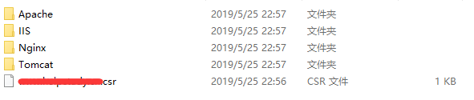

# SpringBoot使用腾讯云SSL 证书并开启HTTPS 访问

## 1. 导入证书

从腾讯云申请并下载SSL证书，解压后的文件结构为：



**SpringBoot 只需要 tomcat 下的文件即可**

tomcat下的文件：


keystorePass.txt ：保存证书密码

www...jks：JKS 证书


这里的 JKS 证书下载下来时的名称为：域名.jks。将 JKS 证书拷贝至 SpringBoot 项目的 resources 文件夹下，与 application.properties 同级


## 2. 修改配置文件

配置文件加上以下配置项：

注意：如果原来有启动端口的设置，可以先改为 443

```java
# ssl配置
# https加密端口号 443
# 服务器运行端口
server.port=443
# SSL证书路径 一定要加上classpath，证书名只能有一个后缀，否则找不到不到文件，如：name.cn.jks 则找不到
server.ssl.key-store=classpath:证书名.jks
# SSL证书密码
server.ssl.key-store-password=证书密码
# 证书类型
server.ssl.key-store-type=JKS
# 证书别名，建议设置为证书域名，否则可能报错（Invalid keystore format），如：www.baidu.cn
server.ssl.key-alias=证书别名
```

## 3. 修改 Maven 打包配置

jks 文件在 resources 中存放时，Maven 打包过程中可能通过编译、压缩等破坏该文件，所以添加以下配置，打包时不处理 jks 文件

```html
<build>
    <plugin>
        <groupId>org.apache.maven.plugins</groupId>
        <artifactId>maven-resources-plugin</artifactId>
        <configuration>
            <nonFilteredFileExtensions>
                <!-- 避免 https 证书文件被修改 -->
                <nonFilteredFileExtension>jks</nonFilteredFileExtension>
            </nonFilteredFileExtensions>
        </configuration>
    </plugin>
</build>
```

## 4. 启动测试

通过上面的配置服务器已经可以启动了，运行 SpringBoot 应用即可启动。

**但，启动后访问浏览器 127.0.0.1:8080 会提示 Bad Request，为什么呢？**

问：为什么要访问 8080 端口，不是配置端口为 443 了吗？

答：使用 SSL 证书后，配置的端口已经是 HTTPS 的访问端口了。

​这里没有加协议头，默认使用 HTTP 访问。

​再想想，当我们的项目不配置运行端口时，默认的是不是 8080 呢？

​所以这里也一样，默认的 HTTP 端口就是 8080。

因为默认浏览器使用 http 协议发起请求，但是服务器配置 SSL 证书后就只接受 HTTPS 的请求了。

再次测试，浏览器访问：https://127.0.0.1 ，访问成功，HTTPS 默认使用 443 端口，所以不用加端口号。

**这就有问题了，我们输域名地址时，谁会故意加上 HTTPS？**

**所以就有了第三步，重定向**
 
## 5.将 HTTP 请求重定向到 HTTPS 请求

### 重写启动类

```java
@SpringBootApplication
public class HelpStudyApplication {
 
    // http 请求端口，线上配置为 80
    @Value("${server.port.http}")
    private int serverPortHttp;
 
    // 服务器运行端口，等同于 HTTPS 请求端口，线上 443
    @Value("${server.port}")
    private int serverPortHttps;
 
    public static void main(String[] args) {
        SpringApplication.run(HelpStudyApplication.class, args);
    }
 
    /**
     * http重定向到https
     */
    @Bean
    public TomcatServletWebServerFactory servletContainer() {
        TomcatServletWebServerFactory tomcat;
        tomcat = new TomcatServletWebServerFactory() {
            @Override
            protected void postProcessContext(Context context) {
                SecurityConstraint constraint = new SecurityConstraint();
                constraint.setUserConstraint("CONFIDENTIAL");
                SecurityCollection collection = new SecurityCollection();
                collection.addPattern("/*");
                constraint.addCollection(collection);
                context.addConstraint(constraint);
            }
        };
        tomcat.addAdditionalTomcatConnectors(httpConnector());
        return tomcat;
    }
 
    @Bean
    public Connector httpConnector() {
        Connector connector = new Connector(Http11NioProtocol.class.getName());
        connector.setScheme("http");
        //Connector监听的http的端口号
        connector.setPort(serverPortHttp);
        connector.setSecure(false);
        //监听到http的端口号后转向到的https的端口号
        connector.setRedirectPort(serverPortHttps);
        return connector;
    }
}
```

重要变量都加了注释，使用上面的启动类还要在配置文件中添加以下配置项：

```java
# 配置服务器运行端口
server.port=443 
# http 监听端口，用于重定向到 https 端口
server.port.http=80
```

经过上面的配置后，启动 SpringBoot 应用后，浏览器访问 127.0.0.1 会发现会自动重定向到 https://127.0.0.1