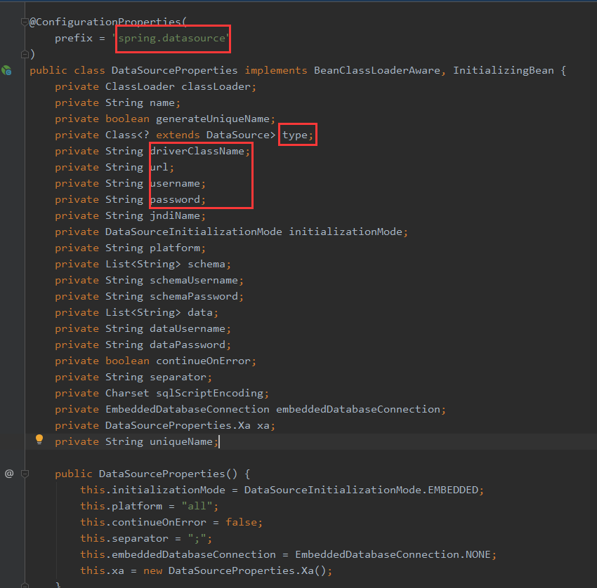
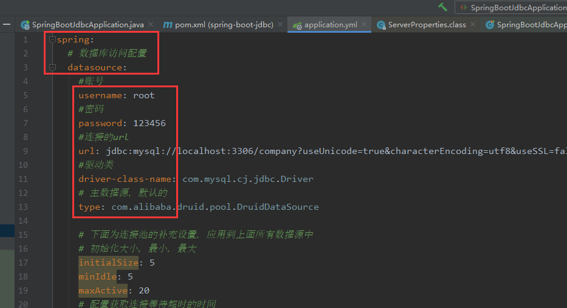

# # 使用Druid数据源

一个企业项目中最重要的部分那就是数据库了，对数据库的连接，读写是重中之重。在SpringBoot中数据库怎么连接呢？

### 数据库的连接

  这里以MySql为例，还不会用MySql数据库的童鞋，可以看我之前的博客，[数据库相关](https://blog.csdn.net/qq_27634797/article/category/8050256)。

   **第一步，** 我们首先在pom.xml中添加jdbc相关的启动器。

```
        <!--jdbc启动器-->
        <dependency>
            <groupId>org.springframework.boot</groupId>
            <artifactId>spring-boot-starter-jdbc</artifactId>
        </dependency>
        <!--mysql驱动包-->
        <dependency>
            <groupId>mysql</groupId>
            <artifactId>mysql-connector-java</artifactId>
            <scope>runtime</scope>
        </dependency>
1234567891011
```

   **第二步，** 在配置文件中配置连接数据库的信息：

```
spring:
  datasource:
    #连接数据库的账号
    username: root
    #连接数据库的密码
    password: 123456
    #连接数据库的url
    url: jdbc:mysql://localhost:3306/company?useUnicode=true&characterEncoding=utf8&useSSL=false&serverTimezone=GMT%2B8
    #连接数据库的驱动类
    #mysql8之前用的是：com.mysql.jdbc.Driver。
    #mysql8之后用的是：com.mysql.cj.jdbc.Driver
    driver-class-name: com.mysql.cj.jdbc.Driver
123456789101112
```

   添加如上信息，就基本上完成了。测试一下连接就可以了。在我们的测试类中添加如下代码，看看打印的数据即可。

```
package com.haichenyi.springbootjdbc;

import org.junit.Test;
import org.junit.runner.RunWith;
import org.springframework.beans.factory.annotation.Autowired;
import org.springframework.boot.test.context.SpringBootTest;
import org.springframework.test.context.junit4.SpringRunner;

import javax.sql.DataSource;
import java.sql.Connection;
import java.sql.SQLException;

@RunWith(SpringRunner.class)
@SpringBootTest
public class SpringBootJdbcApplicationTests {
    @Autowired
    DataSource dataSource;

    @Test
    public void contextLoads() throws SQLException {
        System.out.println("dataSource: " + dataSource.getClass());
        Connection connection = dataSource.getConnection();
        System.out.println("connection: " + connection);
        connection.close();
    }

}
```

   我们这里是测试数据库是否连接成功，我们才获取的这个连接，打印出来，我们项目里面实际操作数据库的时候，不需要我们获取这个连接，然后通过这个连接再去操作数据库。这是不需要，MyBatis通过Mapping注解直接操作数据库，我们只用写sql语句就可以了。

### Druid连接数据库

   DRUID是阿里巴巴开源平台上一个数据库连接池实现，它结合了C3P0、DBCP、PROXOOL等DB池的优点，同时加入了日志监控，可以很好的监控DB池连接和SQL的执行情况，可以说是针对监控而生的DB连接池，据说是目前最好的连接池。

   **上面的配置继续保留。**

   **第一步：** 我们在pom.xml里面添加druid的依赖：

```
<!-- https://mvnrepository.com/artifact/com.alibaba/druid -->
<dependency>
    <groupId>com.alibaba</groupId>
    <artifactId>druid</artifactId>
    <version>1.1.20</version>
</dependency>
```

   **第二步：** 在yml文件中添加如下代码：

```
spring:
  # 数据库访问配置
  datasource:
    #账号
    username: root
    #密码
    password: 123456
    #连接的url
    url: jdbc:mysql://localhost:3306/company?useUnicode=true&characterEncoding=utf8&useSSL=false&serverTimezone=GMT%2B8
    #驱动类
    driver-class-name: com.mysql.cj.jdbc.Driver
    # 主数据源，默认的
    type: com.alibaba.druid.pool.DruidDataSource

    # 下面为连接池的补充设置，应用到上面所有数据源中
    # 初始化大小，最小，最大
    initialSize: 5
    minIdle: 5
    maxActive: 20
    # 配置获取连接等待超时的时间
    maxWait: 60000
    # 配置间隔多久才进行一次检测，检测需要关闭的空闲连接，单位是毫秒
    timeBetweenEvictionRunsMillis: 60000
    # 配置一个连接在池中最小生存的时间，单位是毫秒
    minEvictableIdleTimeMillis: 300000
    validationQuery: SELECT 1 FROM DUAL
    testWhileIdle: true
    testOnBorrow: false
    testOnReturn: false
    # 打开PSCache，并且指定每个连接上PSCache的大小
    poolPreparedStatements: true
    maxPoolPreparedStatementPerConnectionSize: 25
    # 配置监控统计拦截的filters，去掉后监控界面sql无法统计，'wall'用于防火墙
    filters: stat,wall,logback
    # 通过connectProperties属性来打开mergeSql功能；慢SQL记录
    connectionProperties: druid.stat.mergeSql=true;druid.stat.slowSqlMillis=500
    # 合并多个DruidDataSource的监控数据
    useGlobalDataSourceStat: true
```

   这样，就可以了。继续运行刚才的测试方法，你会发现，打印数据里面数据源已经变成了DruidDataSource。

   你如果是debug运行的，并且，你的断点打在connection那里，你会发现，我们yml文件中的补充配置，没起作用，是为什么呢？

   我们按住CTRL，鼠标左键点补充配置里面的任意一个变量，都点不动，我们点上面的type，url等等，都能点，我们点过去看，我们会发现跳到了 **DataSourceProperties** 。这个类，顾名思义这是数据源配置文件类。我们大致看一下这个类的代码：



   用红色框框，框出来的地方是不是很眼熟？

   首先，我们先看注解 **@ConfigurationProperties，** 这个注解就是表示这个类是配置类，然后，我们看括号里面的参数 **prefix，** 顾名思义：前缀，前置代码。



   如上图，上面的红色框框的内容，就由prefix决定，下面红色框框的内容，就由这个类的变量决定。我们上面的补充设置不起作用，就是因为这个配置文件里面没有这些变量，SpringBoot识别不了，所以，不起作用。SpringBoot不是万能的，它配置了的东西，可以识别，没有配置的，识别不了。

   怎么样让上面的补充配置起作用呢？有多种方式：

   **第一种方式如下：** 简单粗暴，添加一个配置类即可

```
package com.haichenyi.springbootjdbc.config;

import com.alibaba.druid.pool.DruidDataSource;
import org.springframework.boot.context.properties.ConfigurationProperties;
import org.springframework.context.annotation.Bean;
import org.springframework.context.annotation.Configuration;

import javax.sql.DataSource;

@Configuration
public class JdbcConfig {
    @ConfigurationProperties(prefix = "spring.datasource")
    @Bean
    public DataSource dataSource(){
        return new DruidDataSource();
    }
}
```

   这个方式就相当于，把我们上面的这个 **DataSourceProperties**配置类，换成了 **DruidDataSource**类。

   **第二种方式如下：** 比较麻烦，也不算特别麻烦：说白了就是加载局部配置。

  首先，在resources目录下，新建一个jdbc.properties文件

```
#账号
druid.datasource.username=root
#密码
druid.datasource.password=123456
#连接的url
druid.datasource.url=jdbc:mysql://localhost:3306/company?useUnicode=true&characterEncoding=utf8&useSSL=false&serverTimezone=GMT%2B8
#驱动类
druid.datasource.driverClassName=com.mysql.cj.jdbc.Driver
# 主数据源，默认的
# druid.datasource.type=com.alibaba.druid.pool.DruidDataSource
# 下面为连接池的补充设置，应用到上面所有数据源中
# 初始化大小，最小，最大
druid.datasource.initialSize=5
druid.datasource.minIdle=5
druid.datasource.maxActive=20
# 配置获取连接等待超时的时间
druid.datasource.maxWait=60000
# 配置间隔多久才进行一次检测，检测需要关闭的空闲连接，单位是毫秒
druid.datasource.timeBetweenEvictionRunsMillis=60000
# 配置一个连接在池中最小生存的时间，单位是毫秒
druid.datasource.minEvictableIdleTimeMillis=300000
druid.datasource.validationQuery=SELECT 1 FROM DUAL
druid.datasource.testWhileIdle=true
druid.datasource.testOnBorrow=false
druid.datasource.testOnReturn=false
# 打开PSCache，并且指定每个连接上PSCache的大小
druid.datasource.poolPreparedStatements=true
druid.datasource.maxPoolPreparedStatementPerConnectionSize=25
# 配置监控统计拦截的filters，去掉后监控界面sql无法统计，'wall'用于防火墙
druid.datasource.filters=stat,wall,logback
# 通过connectProperties属性来打开mergeSql功能；慢SQL记录
druid.datasource.connectionProperties=druid.stat.mergeSql=true;druid.stat.slowSqlMillis=500
# 合并多个DruidDataSource的监控数据
druid.datasource.useGlobalDataSourceStat=true
```

  就是把我们刚才在全局配置中配置的信息，在专门的jdbc的配置文件中配置一遍。然后，修改我们的JdbcConfig类。如下：

```
package com.haichenyi.springbootjdbc.config;

import com.alibaba.druid.pool.DruidDataSource;
import org.springframework.beans.factory.annotation.Value;
import org.springframework.context.annotation.Bean;
import org.springframework.context.annotation.Configuration;
import org.springframework.context.annotation.PropertySource;

import javax.sql.DataSource;
import java.sql.SQLException;

@Configuration
@PropertySource(value = "classpath:config/jdbc.properties", ignoreResourceNotFound = true)
public class JdbcConfig {
    @Value("${druid.datasource.username}")
    private String username;
    @Value("${druid.datasource.password}")
    private String password;
    @Value("${druid.datasource.url}")
    private String url;
    @Value("${druid.datasource.driverClassName}")
    private String driverClassName;
    @Value("${druid.datasource.initialSize}")
    private Integer initialSize;
    @Value("${druid.datasource.minIdle}")
    private Integer minIdle;
    @Value("${druid.datasource.maxActive}")
    private Integer maxActive;
    @Value("${druid.datasource.maxWait}")
    private Long maxWait;
    @Value("${druid.datasource.timeBetweenEvictionRunsMillis}")
    private Long timeBetweenEvictionRunsMillis;
    @Value("${druid.datasource.minEvictableIdleTimeMillis}")
    private Long minEvictableIdleTimeMillis;
    @Value("${druid.datasource.validationQuery}")
    private String validationQuery;
    @Value("${druid.datasource.testWhileIdle}")
    private Boolean testWhileIdle;
    @Value("${druid.datasource.testOnBorrow}")
    private Boolean testOnBorrow;
    @Value("${druid.datasource.testOnReturn}")
    private Boolean testOnReturn;
    @Value("${druid.datasource.maxPoolPreparedStatementPerConnectionSize}")
    private Integer maxPoolPreparedStatementPerConnectionSize;
    @Value("${druid.datasource.poolPreparedStatements}")
    private Boolean poolPreparedStatements;
    @Value("${druid.datasource.filters}")
    private String filters;
    @Value("${druid.datasource.connectionProperties}")
    private String connectionProperties;
    @Value("${druid.datasource.useGlobalDataSourceStat}")
    private Boolean useGlobalDataSourceStat;

    @Bean
    public DataSource dataSource() throws SQLException {
        DruidDataSource druidDataSource = new DruidDataSource();
        druidDataSource.setUsername(username);
        druidDataSource.setPassword(password);
        druidDataSource.setUrl(url);
        druidDataSource.setDriverClassName(driverClassName);
        druidDataSource.setInitialSize(initialSize);
        druidDataSource.setMinIdle(minIdle);
        druidDataSource.setMaxActive(maxActive);
        druidDataSource.setTimeBetweenEvictionRunsMillis(timeBetweenEvictionRunsMillis);
        druidDataSource.setMinEvictableIdleTimeMillis(minEvictableIdleTimeMillis);
        druidDataSource.setValidationQuery(validationQuery);
        druidDataSource.setTestOnBorrow(testOnBorrow);
        druidDataSource.setTestOnReturn(testOnReturn);
        druidDataSource.setTestWhileIdle(testWhileIdle);
        druidDataSource.setMaxPoolPreparedStatementPerConnectionSize(maxPoolPreparedStatementPerConnectionSize);
        druidDataSource.setPoolPreparedStatements(poolPreparedStatements);
        druidDataSource.setFilters(filters);
        druidDataSource.setConnectionProperties(connectionProperties);
        druidDataSource.setUseGlobalDataSourceStat(useGlobalDataSourceStat);
        return druidDataSource;
    }
}
```

  就是加载配置文件，然后在DataSource里面赋值。这样，就可以了。

### Druid后台监控

  之所以用Druid连接池，还有很大一部分原因就是它的监控功能。它能很好的监控DB连接池和SQL语句的执行情况。在上面的JdbcConfig类中添加如下两个方法即可。

```
    /**
     * 配置Druid监控
     *
     * @return StatViewServlet
     */
    @Bean
    public ServletRegistrationBean servletRegistrationBean() {
        ServletRegistrationBean<StatViewServlet> bean = new ServletRegistrationBean<>(new StatViewServlet(), "/druid/*");
        Map<String, String> map = new HashMap<>();
        //访问的用户名密码
        map.put(StatViewServlet.PARAM_NAME_USERNAME, "haichenyi");
        map.put(StatViewServlet.PARAM_NAME_PASSWORD, "123456");
        //允许访问的ip，默认是所有ip
        map.put(StatViewServlet.PARAM_NAME_ALLOW, "");
        //禁止访问的ip
        map.put(StatViewServlet.PARAM_NAME_DENY, "192.168.1.1");
        bean.setInitParameters(map);
        return bean;
    }

    /**
     * 配置一个监控的filter
     *
     * @return WebStatFilter
     */
    @Bean
    public FilterRegistrationBean filterRegistrationBean() {
        FilterRegistrationBean<WebStatFilter> bean = new FilterRegistrationBean<>();
        bean.setFilter(new WebStatFilter());
        Map<String, String> map = new HashMap<>();
        //移除这些监听
        map.put(WebStatFilter.PARAM_NAME_EXCLUSIONS, "*.js,*.css,/druid/*,*.gif,*.jpg,*.png");
        bean.setInitParameters(map);
        //拦截所有请求，全部都要走druid监听
        bean.setUrlPatterns(Collections.singletonList("/*"));
        return bean;
    }
```

 控制台访问 **http://localhost:8080/druid**。