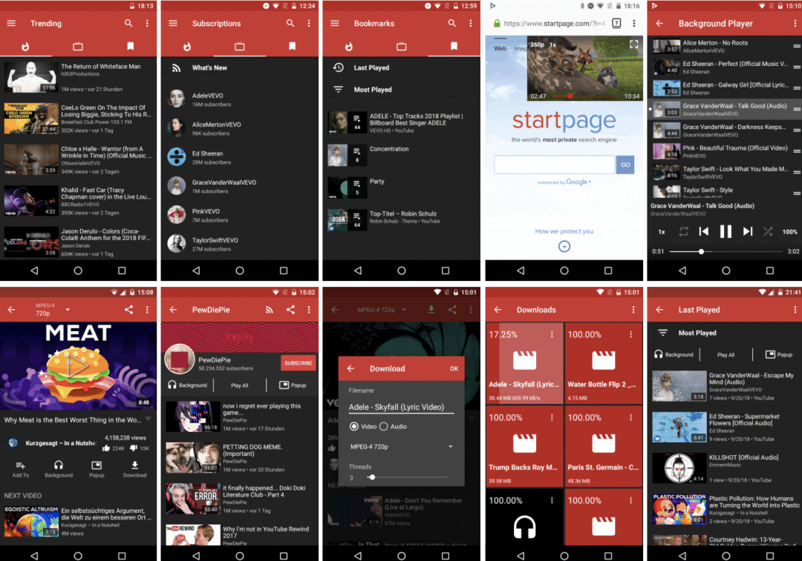

# 高仿开源项目

## **高仿微信**

Github 地址：https://github.com/nacker/LZEasemob3

界面截图：

**Android 版：**

Github 地址：https://github.com/GitLqr/LQRWeChat

界面截图：

## **高仿 youtube**

**iOS 版：**

Github 地址：https://github.com/aslanyanhaik/youtube-iOS

界面截图：

**Android:**

Github 地址：https://github.com/TeamNewPipe/NewPipe

界面截图：

## **高仿网易云音乐**

**iOS 版：**

Github 地址：https://github.com/QuintGao/GKAudioPlayerDemo

界面截图：

**Android:**

Github 地址：https://github.com/aa112901/remusic

界面截图：

## **高仿Bilibili**

**iOS 版：**

Github 地址：https://github.com/MichaelHuyp/Bilibili_Wuxianda

界面截图：

**Android:**

Github 地址：https://github.com/HotBitmapGG/bilibili-android-client

界面截图：

## **高仿微博**

**iOS 版：**

Github 地址：https://github.com/sam408130/DSLolita

**Android:**

Github 地址：https://github.com/wenmingvs/WeiBo

界面截图：

