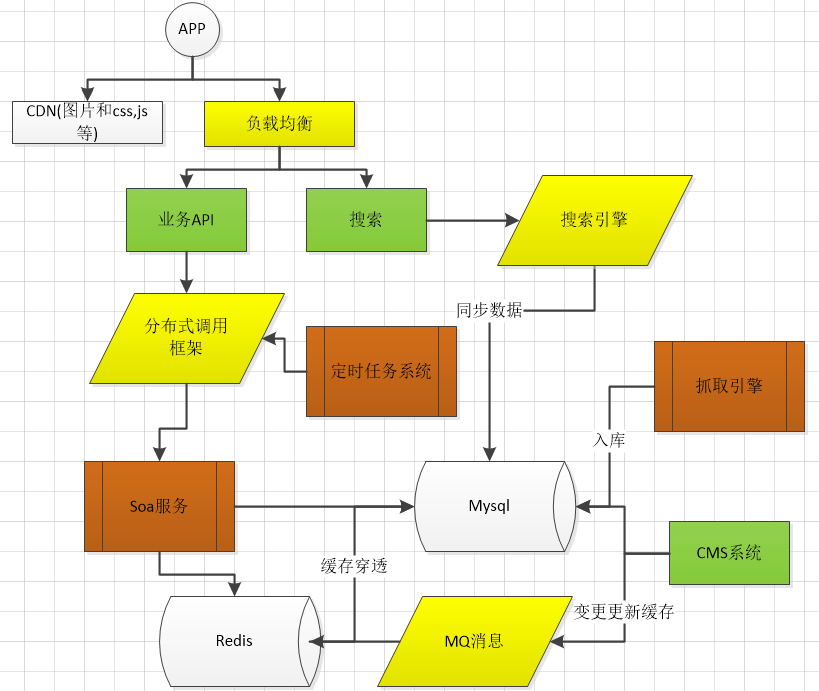

# 技术架构从零到一

由于我在中型互联网公司工作，针对用于手机APP或者pc的后台开发，基本可以支撑几万用户。本文会对可能用到的相关技术进行技术选型的说明，以及技术的架构介绍。其实这里面主要给大家说的是技术选型。

### 技术指标

说一下一些技术指标的计算过程可以作为其他同学的参考

- **QPS**， 如果是5万日活，使用集中在每天的4小时，每个用户大概产生100的请求，那么平均下来，我们系统大概应该支撑的请求为：50000 * 100 / (4 * 60 * 60) = 350 qps/s
- **业务数据量**，我们自己是新闻业务，可能会有其他的业务，比如游戏，商城等等，基本每天新增的业务数据都会在同一个量级， 每日10000， 另外跟用户相关的信息也是比较大的一块，比如用户的订阅等行为，一共5万的用户，保存相关信息可能大概需要100条的数据。
- 缓存大小 主要业务数据和用户相关的热点数据限时保存在缓存中， 大概需要5个G左右。
- 日志大小 用户日志和请求日志。 大概每天3个G左右
- 这些数据需要运维人员的估算，

## 技术架构

 

我们基于阿里云来搭建，对图中的内容和技术选型进行一下说明：

#### 负载均衡

可选方案： SLB, Nginx.

- SLB要收钱，但是比较便宜，有保证，不会挂。 但是可配置的很少，不能根据域名做ip映射
- Nginx, 没啥缺点，需要一定的知识。建议： SLB + Nginx, SLB绑定域名作为统一的入口，然后每个服务器上再搭建Nginx.
- 大多数金融公司的选择

#### CDN

　　用于缓存静态文件等等。 七牛和阿里的都还可以。

- 七牛要做的久一点， 各种图片处理的接口要完善一些
- 阿里的CDN要稍微好一点点， 但是没有不安全的访问方式，访问稍微没有那么灵活。 图片处理功能弱一点。
- 是解决前端延迟的好办法

#### 分布式调用框架

目前可选的有ZK + dubbo. ZK + Motan, ZK + dubbox, edas。

- dubbo, 阿里的服务治理框架，已经不维护了，切换反应有点慢
- dubboX, 当当基于dubbo搞的，还在维护可以一用，推荐。
- Motan, 微博的服务治理矿建， 刚开源，需要学习一下， 推荐。
- Edas, 阿里云服务，要收钱，侵入型很强，不推荐

#### MQ

可选的有： ActiveMQ, rocketMQ， robbitMQ,Kafka各有好处， 但是考虑到运维的难度，推荐rocketMQ。

#### Redis

用来做缓存， 自建成本有点高，需要Codis, 分片，集群，主从等等，很麻烦。 建议直接用阿里的

也可以用来处理分布式的数据共享session的工具、

#### 数据库

主要基于读写分离和主从复制考虑，目前可以自建和选用阿里的DRDS。

- DRDS 要花钱，成本较高，没有必要
- 自建， 不用中间件，直接1写2只读， 然后配置读写分离的数据源，内网SLB进行读集群。解决之。

#### 搜索

apache solr 搜索引擎。相比其他用起来还可以。

建议ELK， 可以自动同步数据库，除了搜索引擎的功能外，还可以做日志搜索，监控系统。

 

代码管理工具

Jenkins 与 Sonar 集成是代码管理工具重要体现。

apache中sonar代码管理。是我们优化方案找出代码不规格的重要工具、Jenkins是我们打包发布重要工具。

#### 一些典型的业务场景说明

把业务底层做成SOA模块，通过分布式调用框架对外提供服务。

后期进行SOA到微服务的改造都会涉及。单独做一个小的系统来运行定时任务热点数据放缓存，然后通过MQ来更新缓存日志等数据有必要可以考虑上个Mongo

 