# 简化版的Mybatis-plus文档 

官网：Mybatis-plus官方文档 简化 MyBatis ！

## 创建数据库

数据库名为mybatis_plus

### 创建表

创建user表

```
DROP TABLE IF EXISTS user;
CREATE TABLE user
(
id BIGINT(20) NOT NULL COMMENT '主键ID',
name VARCHAR(30) NULL DEFAULT NULL COMMENT '姓名',
age INT(11) NULL DEFAULT NULL COMMENT '年龄',
email VARCHAR(50) NULL DEFAULT NULL COMMENT '邮箱',
PRIMARY KEY (id)
);
INSERT INTO user (id, name, age, email) VALUES
(1, 'Jone', 18, 'test1@baomidou.com'),
(2, 'Jack', 20, 'test2@baomidou.com'),
(3, 'Tom', 28, 'test3@baomidou.com'),
(4, 'Sandy', 21, 'test4@baomidou.com'),
(5, 'Billie', 24, 'test5@baomidou.com');
```

注意：-- 真实开发中往往都会有这四个字段，version（乐观锁）、deleted（逻辑删除）、gmt_create（创建时间）、gmt_modified（修改时间）

### 初始化项目

使用SpringBoot器 初始化！

### 导入依赖

```
<!-- 数据库驱动 -->
<dependency>
  <groupId>mysql</groupId>
  <artifactId>mysql-connector-java</artifactId>
</dependency>
<!-- lombok -->
<dependency>
  <groupId>org.projectlombok</groupId>
  <artifactId>lombok</artifactId>
</dependency>
<!-- mybatis-plus -->
<!-- mybatis-plus 是自己开发，并非官方的！ -->
<dependency>
  <groupId>com.baomidou</groupId>
  <artifactId>mybatis-plus-boot-starter</artifactId>
  <version>3.0.5</version>
</dependency>
```

注意：尽量不要同时导入 mybatis 和 mybatis-plus！避免版本的差异造成无法预知的问题。

### 连接数据库

创建application.yml

```
spring:
  profiles:
    active: dev
  datasource:
# 驱动不同 mysql 5  com.mysql.jdbc.Driver
#         mysql 8  com.mysql.cj.jdbc.Driver、需要增加时区的配置serverTimezone=GMT%2B8
    url: jdbc:mysql://localhost:3306/mybatis_plus?useSSL=false&useUnicode=true&characterEncoding=utf-8&serverTimezone=GMT%2B8
    driver-class-name: com.mysql.cj.jdbc.Driver
    username: root
    password: root
```

## 业务代码

```
实体类
@Data
@AllArgsConstructor
@NoArgsConstructor
public class User {
  private Long id;
  private String name;
  private Integer age;
  private String email;
}
```

mapper接口

```
import com.baomidou.mybatisplus.core.mapper.BaseMapper;
import com.kuang.pojo.User;
import org.springframework.stereotype.Repository;
// 在对应的Mapper上面继承基本的类 BaseMapper
@Repository // 代表持久层
public interface UserMapper extends BaseMapper<User> {
  // 所有的CRUD操作都已经编写完成了
}
```

注意点，我们需要在主启动类上去扫描我们的mapper包下的所有接口
@MapperScan(“com.kwhua.mapper”)

### 测试

```
@SpringBootTest
class MybatisPlusApplicationTests {
  // 继承了BaseMapper，所有的方法都来自己父类
  // 我们也可以编写自己的扩展方法！
  @Autowired
  private UserMapper userMapper;
  @Test
  void contextLoads() {
    // 参数是一个 Wrapper ，条件构造器，这里我们先设置条件为空，查询所有。
    List<User> users = userMapper.selectList(null);
    users.forEach(System.out::println);
 }
}
```

所有数据输出

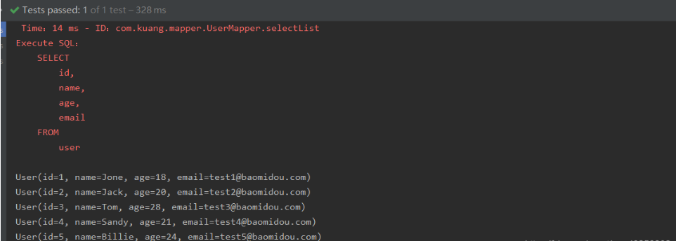


## 配置日志

我们所有的sql现在是不可见的，我们希望知道它是怎么执行的，所有我们要配置日志的输出
application.yml文件添加日志配置

```
#配置日志
mybatis-plus:
  configuration:
    log-impl: org.apache.ibatis.logging.stdout.StdOutImpl
```

查看执行sql的日志信息


## Mybatis-plus的CRUD

### 1.插入操作

```
// 测试插入
    @Test
    public void testInsert(){
        User user = new User();
        user.setName("kwhua_mybatis-plus_insertTest");
        user.setAge(15);
        user.setEmail("310697723@qq.com");

        int result = userMapper.insert(user); // 帮我们自动生成id
        System.out.println(result); // 受影响的行数
        System.out.println(user); // 看到id会自动填充。    }
```

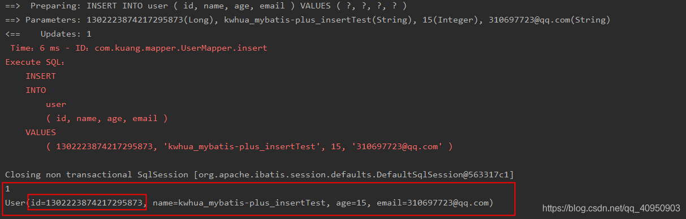


看到id会自动填充。数据库插入的id的默认值为：全局的唯一id

### 主键生成策略

1）主键自增
1、实体类字段上 @TableId(type = IdType.AUTO)
2、数据库id字段设置为自增！

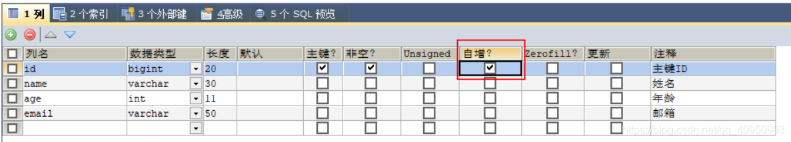


3、再次测试（可以看到id值比上次插入的大1）

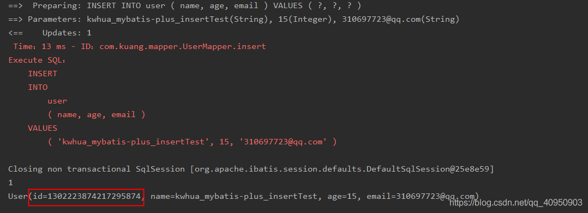


id的生成策略源码解释

```
public enum IdType {
  AUTO(0), // 数据库id自增
  NONE(1), // 未设置主键
  INPUT(2), // 手动输入
  ID_WORKER(3), // 默认的方式,全局唯一id
  UUID(4), // 全局唯一id uuid
  ID_WORKER_STR(5); //ID_WORKER 字符串表示法
}
```

以上不再逐一测试。

### 更新操作

```
 @Test
    public void testUpdate(){
        User user = new User();
        // 通过条件自动拼接动态sql
        user.setId(1302223874217295874L);
        user.setName("kwhua_mybatis-plus_updateTest");
        user.setAge(20);
        // 注意：updateById 但是参数是一个对象！
        int i = userMapper.updateById(user);
        System.out.println(i);
    }
```

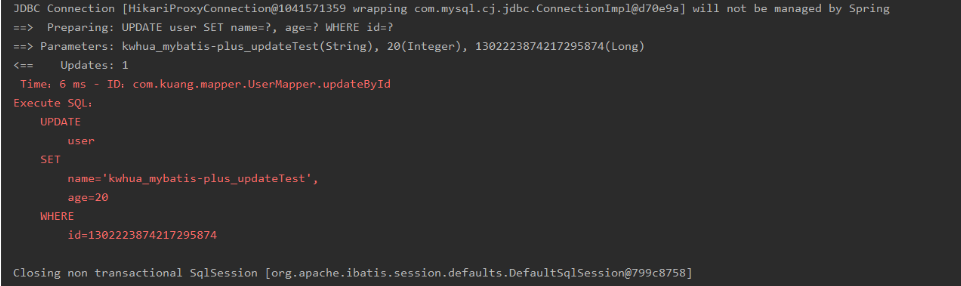


### 自动填充

创建时间、修改时间！这两个字段操作都是自动化完成的，我们不希望手动更新！
阿里巴巴开发手册：所有的数据库表都要配置上gmt_create、gmt_modified！而且需要自动化！
方式一：数据库级别（工作中一般不用）
1、在表中新增字段 gmt_create, gmt_modified

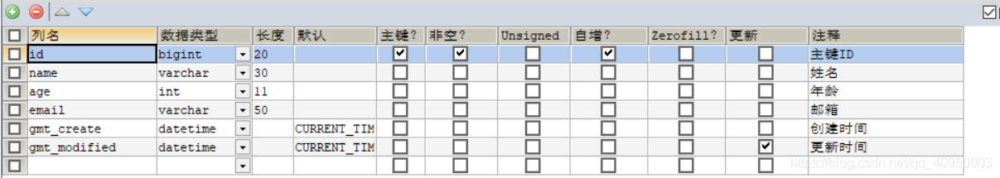


2、把实体类同步

```
private Date gmtCreate;
private Date gmtModified;
```

3、再次查看

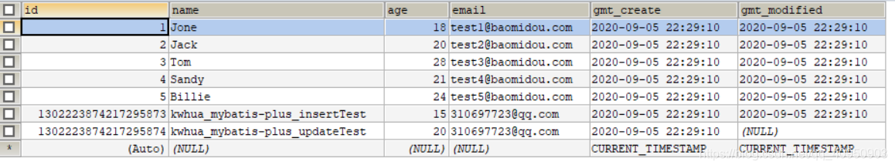


方式二：代码级别
1、删除数据库的默认值、更新操作！


2、实体类字段属性上需要增加注解

```
    // 字段添加填充内容
    @TableField(fill = FieldFill.INSERT)
    private Date gmt_create;

    @TableField(fill = FieldFill.INSERT_UPDATE)
    private Date gmt_modified;
```

3、编写处理器来处理这个注解即可！

```
@Slf4j
@Component // 一定不要忘记把处理器加到IOC容器中！
public class MyMetaObjectHandler implements MetaObjectHandler {
    // 插入时的填充策略
    @Override
    public void insertFill(MetaObject metaObject) {
        log.info("start insert fill.....");
        // setFieldValByName(String fieldName, Object fieldVal, MetaObject metaObject
        this.setFieldValByName("gmt_create",new Date(),metaObject);
        this.setFieldValByName("gmt_modified",new Date(),metaObject);
    }

    // 更新时的填充策略
    @Override
    public void updateFill(MetaObject metaObject) {
        log.info("start update fill.....");
        this.setFieldValByName("gmt_modified",new Date(),metaObject);
    }
}
```

4、测试插入和更新，检查时间变化。

### 乐观锁

乐观锁 : 顾名思义，十分乐观，它总是认为不会出现问题，无论干什么不去上锁！如果出现了问题，
再次更新值测试
悲观锁：顾名思义，十分悲观，它总是认为总是出现问题，无论干什么都会上锁！再去操作！

乐观锁实现方式：

取出记录时，获取当前version
更新时，带上这个version
执行更新时， set version = newVersion where version = oldVersion
如果version不对，就更新失败

```
乐观锁：1、先查询，获得版本号 version = 1
-- A
update user set name = "kwhua", version = version + 1
where id = 2 and version = 1
-- B 线程抢先完成，这个时候 version = 2，会导致 A 修改失败！
update user set name = "kwhua", version = version + 1
where id = 2 and version = 1
```

**乐观锁测试**
1、给数据库中增加version字段！

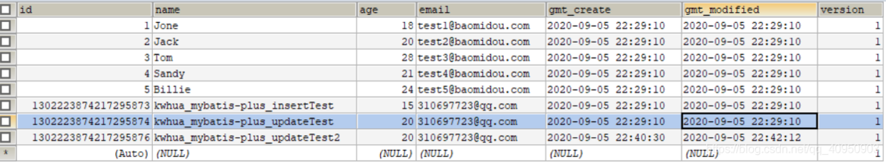

2、实体类加对应的字段

```
    @Version //乐观锁Version注解
    private Integer version;
```

3、注册组件

```
// 扫描我们的 mapper 文件夹
@MapperScan("com.kwhua.mapper")
@EnableTransactionManagement
@Configuration // 配置类
public class MyBatisPlusConfig {
    // 注册乐观锁插件
    @Bean
    public OptimisticLockerInterceptor optimisticLockerInterceptor() {
        return new OptimisticLockerInterceptor();
    }
   }
```

4、测试

```
// 测试乐观锁成功！
    @Test
    public void testOptimisticLocker(){
        // 1、查询用户信息
        User user = userMapper.selectById(1L);
        // 2、修改用户信息
        user.setName("kwhua");
        user.setEmail("123456@qq.com");
        // 3、执行更新操作
        userMapper.updateById(user);
    }
```

version字段已经由1变成了2

```
// 测试乐观锁失败！多线程下
    @Test
    public void testOptimisticLocker2(){

        // 线程 1
        User user = userMapper.selectById(1L);
        user.setName("kwhua111");
        user.setEmail("123456@qq.com");

        // 模拟另外一个线程执行了插队操作
        User user2 = userMapper.selectById(1L);
        user2.setName("kwhua222");
        user2.setEmail("123456@qq.com");
        userMapper.updateById(user2);

        // 自旋锁来多次尝试提交！
        userMapper.updateById(user); // 如果没有乐观锁就会覆盖插队线程的值！
    }
```

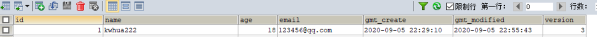


可以看到线程1执行更新失败

### 查询操作

```
// 测试查询
    @Test
    public void testSelectById(){
        User user = userMapper.selectById(1L);
        System.out.println(user);
    }

    // 测试批量查询！
    @Test
    public void testSelectByBatchId(){
        List<User> users = userMapper.selectBatchIds(Arrays.asList(1, 2, 3));
        users.forEach(System.out::println);
    }

    // 按条件查询之一使用map操作
    @Test
    public void testSelectByBatchIds(){
        HashMap<String, Object> map = new HashMap<>();
        // 自定义要查询
        map.put("name","kwhua");
        map.put("age",15);

        List<User> users = userMapper.selectByMap(map);
        users.forEach(System.out::println);
    }
```

**6.1分页查询**
1、配置拦截器组件

```
// 分页插件
@Bean
public PaginationInterceptor paginationInterceptor() {
  return  new PaginationInterceptor();
}
```

2、直接使用Page对象即可！

```
// 测试分页查询
@Test
public void testPage(){
  // 参数一：当前页
  // 参数二：页面大小
  Page<User> page = new Page<>(2,5);
  userMapper.selectPage(page,null);
  page.getRecords().forEach(System.out::println);
  System.out.println(page.getTotal());
}
```

### 物理删除

```
// 测试删除
    @Test
    public void testDeleteById(){
        userMapper.deleteById(1L);
    }

    // 通过id批量删除
    @Test
    public void testDeleteBatchId(){
        userMapper.deleteBatchIds(Arrays.asList(2L,3L));
    }

    // 通过map删除
    @Test
    public void testDeleteMap(){
        HashMap<String, Object> map = new HashMap<>();
        map.put("name","kwhua");
        userMapper.deleteByMap(map);
    }
```

### 逻辑删除

物理删除 ：从数据库中直接移除
逻辑删除 ：在数据库中没有被移除，而是通过一个变量来让它失效！ deleted = 0 => deleted = 1
管理员可以查看被删除的记录！防止数据的丢失，类似于回收站！

1、在数据表中增加一个 deleted 字段

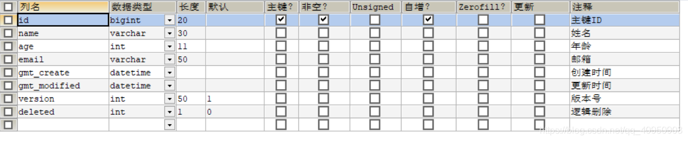

2、实体类中增加属性

```
 @TableLogic //逻辑删除
 private Integer deleted;
```

3、配置

```
    // 逻辑删除组件！
    @Bean
    public ISqlInjector sqlInjector() {
        return new LogicSqlInjector();
    }
```

配置文件配置

```
  global-config:
    db-config:
      logic-delete-value: 1
      logic-not-delete-value: 0
```

4、测试
测试删除

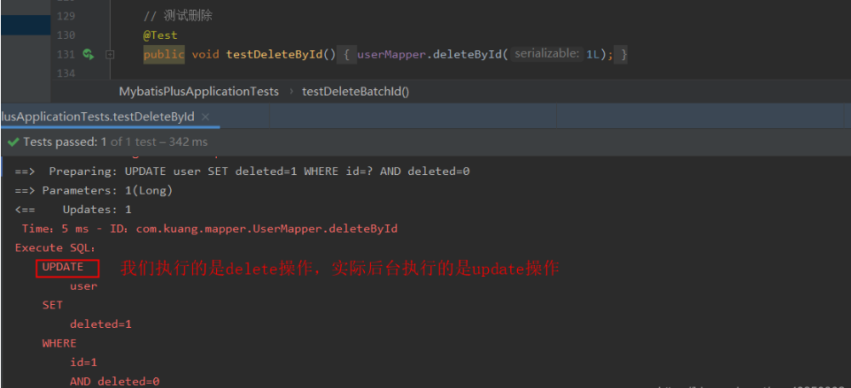


字段值也从0修改成了1

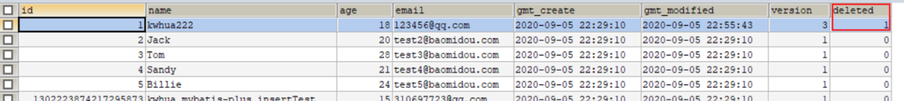


测试查询

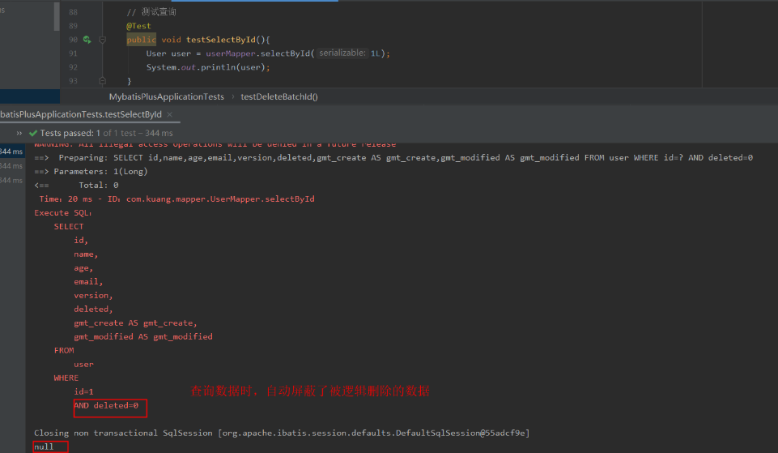


## 性能分析插件

作用：性能分析拦截器，用于输出每条 SQL 语句及其执行时间
MP也提供性能分析插件，如果超过这个时间就停止运行！
1、导入插件

```
/**
     * SQL执行效率插件
     */
    @Bean
    @Profile({"dev","test"})// 设置 dev test 环境开启，保证我们的效率
    public PerformanceInterceptor performanceInterceptor() {
        PerformanceInterceptor performanceInterceptor = new PerformanceInterceptor();
        performanceInterceptor.setMaxTime(100); //ms 设置sql执行的最大时间，如果超过了则不执行
        performanceInterceptor.setFormat(true);
        return performanceInterceptor;
    }
```

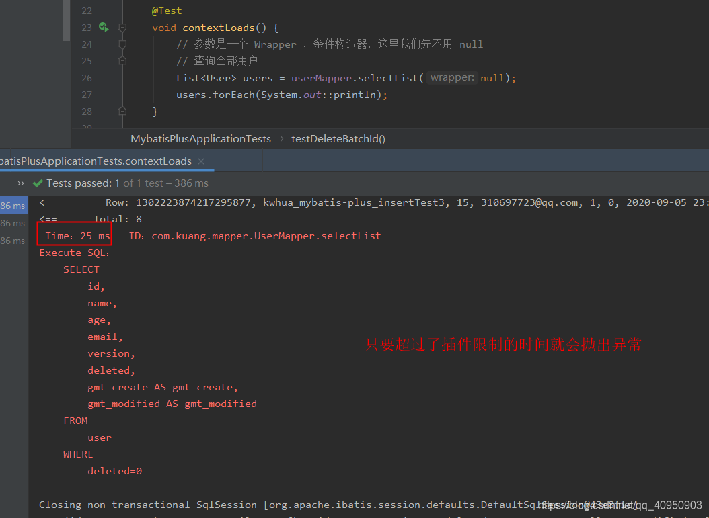


## 条件构造器(Wrapper)

### .isNotNull .gt

```
@Test
    void contextLoads() {
        // 查询name不为空的用户，并且邮箱不为空的用户，年龄大于等于12
        QueryWrapper<User> wrapper = new QueryWrapper<>();
        wrapper
                .isNotNull("name") //不为空
                .isNotNull("email")
                .ge("age",18);
        userMapper.selectList(wrapper).forEach(System.out::println); // 和我们刚才学习的map对比一下
    }
```

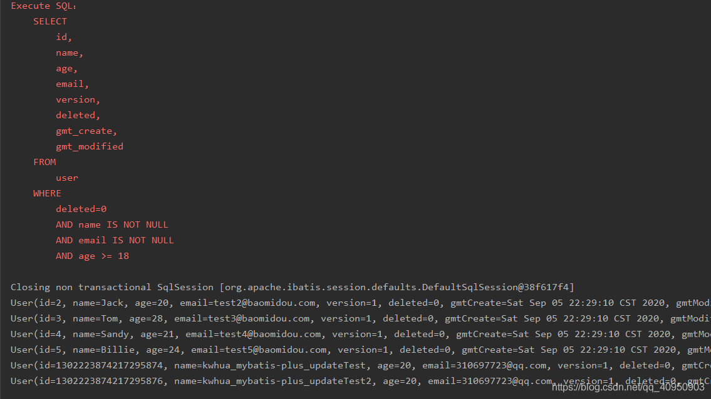


### .eq

```
 @Test
    void test2(){
        // 查询名字kwhua
        QueryWrapper<User> wrapper = new QueryWrapper<>();
        wrapper.eq("name","kwhua");
        User user = userMapper.selectOne(wrapper); // 查询一个数据用selectOne，查询多个结果使用List 或者 Map
        System.out.println(user);
    }
```

### .between

```
@Test
    void test3(){
        // 查询年龄在 20 ~ 30 岁之间的用户
        QueryWrapper<User> wrapper = new QueryWrapper<>();
        wrapper.between("age",20,30); // 区间
        Integer count = userMapper.selectCount(wrapper);// 查询结果数
        System.out.println(count);
    }
```

### .like

```
 // 模糊查询
    @Test
    void test4(){
        // 查询名字中不带e且 邮箱以t开头的数据
        QueryWrapper<User> wrapper = new QueryWrapper<>();
        // 左 likelift  %t  ，右 likeRight  t%
        wrapper
                .notLike("name","e")
                .likeRight("email","t");

        List<Map<String, Object>> maps = userMapper.selectMaps(wrapper);
        maps.forEach(System.out::println);
    }
```

### .insql

```
 // 模糊查询
    @Test
    void test5(){

        QueryWrapper<User> wrapper = new QueryWrapper<>();
        // id 在子查询中查出来
        wrapper.inSql("id","select id from user where id<3");

        List<Object> objects = userMapper.selectObjs(wrapper);
        objects.forEach(System.out::println);
    }
```

### .orderByAsc

```
//测试六
    @Test
    void test6(){
        QueryWrapper<User> wrapper = new QueryWrapper<>();
        // 通过id进行排序
        wrapper.orderByAsc("id");

        List<User> users = userMapper.selectList(wrapper);
        users.forEach(System.out::println);
    }
```

## 代码自动生成器

可以在test文件夹在创建一个java类

```
// 代码自动生成器
public class generateCode {
   public static void main(String[] args) {
    // 需要构建一个 代码自动生成器 对象
    AutoGenerator mpg = new AutoGenerator();
    // 配置策略
    // 1、全局配置
    GlobalConfig gc = new GlobalConfig();
    String projectPath = System.getProperty("user.dir");
    gc.setOutputDir(projectPath+"/src/main/java");
    gc.setAuthor("kwhua");//作者名称
    gc.setOpen(false);
    gc.setFileOverride(false); // 是否覆盖
    gc.setIdType(IdType.ID_WORKER);
    gc.setDateType(DateType.ONLY_DATE);
    gc.setSwagger2(true);//实体属性 Swagger2 注解

    // 自定义文件命名，注意 %s 会自动填充表实体属性！
    gc.setServiceName("%sService"); 
    gc.setControllerName("%sController");
    gc.setServiceName("%sService");
    gc.setServiceImplName("%sServiceImpl");
    gc.setMapperName("%sMapper");
    gc.setXmlName("%sMapper");

    mpg.setGlobalConfig(gc);

    //2、设置数据源
    DataSourceConfig dsc = new DataSourceConfig();
    dsc.setUrl("jdbc:mysql://localhost:3306/kwhua_test?
useSSL=false&useUnicode=true&characterEncoding=utf-8&serverTimezone=GMT%2B8");
    dsc.setDriverName("com.mysql.cj.jdbc.Driver");
    // dsc.setDriverName("com.mysql.jdbc.Driver"); //mysql5.6以下的驱动
    dsc.setUsername("root");
    dsc.setPassword("root");
    dsc.setDbType(DbType.MYSQL);
    mpg.setDataSource(dsc);
    //3、包的配置
    PackageConfig pc = new PackageConfig();
    pc.setParent("com.kwhua"); //包名
    pc.setModuleName("model"); //模块名
    pc.setEntity("entity");
    pc.setMapper("mapper");
    pc.setService("service");
    pc.setController("controller");
    mpg.setPackageInfo(pc);

    //4、策略配置
    StrategyConfig strategy = new StrategyConfig();
    strategy.setInclude("user","course"); // 设置要映射的表名
    strategy.setNaming(NamingStrategy.underline_to_camel);
    strategy.setColumnNaming(NamingStrategy.underline_to_camel);
    strategy.setEntityLombokModel(true); // 自动lombok；
    strategy.setLogicDeleteFieldName("deleted");
    // 自动填充配置
    TableFill gmtCreate = new TableFill("gmt_create", FieldFill.INSERT);
    TableFill gmtModified = new TableFill("gmt_modified",FieldFill.INSERT_UPDATE);
    ArrayList<TableFill> tableFills = new ArrayList<>();
    tableFills.add(gmtCreate);
    tableFills.add(gmtModified);
    strategy.setTableFillList(tableFills);
    // 乐观锁
    strategy.setVersionFieldName("version");
    //根据你的表名来建对应的类名，如果你的表名没有下划线，比如test，那么你就可以取消这一步
    strategy.setTablePrefix("t_");
    strategy.setRestControllerStyle(true); //rest请求
    //自动转下划线，比如localhost:8080/hello_id_2
    strategy.setControllerMappingHyphenStyle(true); 
    mpg.setStrategy(strategy);
    mpg.execute(); //执行
 }
}
```

**执行主方法即可生成对应代码**